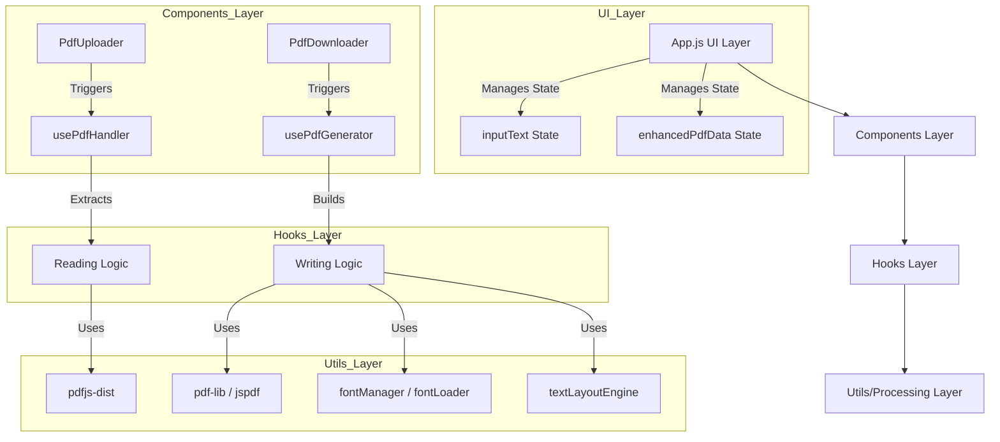

# Codebase Analysis: PDF Architecture & Extensibility

## 1. Executive Summary
Zero-ZeroGPT is a React-based application designed to evade AI detection by replacing standard spaces with Unicode alternatives. The current architecture revolves heavily around PDF processing, implementing a robust pipeline for text extraction, layout preservation, and document regeneration. The system is modular, separating UI (Components), state logic (Hooks), and low-level processing (Utils). Adding support for Word (.docx) and Markdown (.md) will require replicating the existing "Handler" (input) and "Generator" (output) patterns while leveraging the existing core transformation logic in `App.js`.

## 2. Architecture Overview

The application follows a standard layered React architecture:



### Key Data Structures
Defined in `src/utils/pdfTypes.js`, the application relies on a structured data format to preserve document fidelity:
*   **`ExtractedPdfData`**: The root object containing metadata, fonts, and page layouts.
*   **`TextItem`**: Represents a single text element with position (x, y), font, color, and transform matrix.
*   **`PageLayout`**: Dimensions and margins of a page.

## 3. Core Data Flow Pattern

The application executes a clear 4-step process for document handling:

### 1. Upload & Extraction (Input)
*   **Component**: `PdfUploader.jsx`
*   **Hook**: `usePdfHandler.js`
*   **Process**:
    1.  User selects a file.
    2.  `pdfjs-dist` reads the binary data.
    3.  `extractPdfWithLayout` parses the document, extracting not just text strings but also spatial data (`x`, `y`), font information, and colors.
    4.  **Crucial Output**: Returns both a plain text string (for the UI editor) and an `enhancedPdfData` object (for later reconstruction).

### 2. State Management
*   **Component**: `App.js`
*   **Responsibility**:
    *   Holds `inputText` (mutable plain text).
    *   Holds `enhancedPdfData` (immutable layout reference).
    *   Holds `isLayoutPreserved` flag.

### 3. Transformation (Core Logic)
*   **Component**: `App.js`
*   **Function**: `replaceSpaces(text, unicodeCharacter)`
*   **Process**: The user selects a Unicode space type (e.g., "Thin Space"). The application performs a global string replacement on the `inputText`.

### 4. Generation & Download (Output)
*   **Component**: `PdfDownloader.jsx`
*   **Hook**: `usePdfGenerator.js`
*   **Process**:
    *   **Simple Mode**: Uses `jspdf` to write the `inputText` as a basic text document.
    *   **Layout Preserved Mode**: Uses `pdf-lib`. It iterates through the original `enhancedPdfData`. It maps the *transformed* text back to the original spatial coordinates using character offsets (`charOffsetStart`, `charOffsetEnd`), ensuring the new "invisible" spaces don't break the visual layout.
    *   **Font Handling**: Uses `fontLoader.js` to fetch and embed Unicode-compatible fonts (e.g., Noto Sans) because standard PDF fonts (Helvetica) often do not render special Unicode spaces correctly.

## 4. Dependencies Analysis

The project `package.json` defines specific tools for the current PDF workflow. New dependencies will be needed for other formats.

### Existing PDF Dependencies
*   **`pdfjs-dist`**: Reading/Parsing PDFs. High-fidelity extraction.
*   **`pdf-lib`**: modifying and creating PDFs. Used for layout-preserved generation.
*   **`jspdf`**: Simple PDF generation (fallback/text-only).
*   **`@pdf-lib/fontkit`**: Font processing for `pdf-lib`.

### Gaps for New Formats
*   **Word (.docx)**: No existing dependencies. Will likely require `mammoth` (reading) and `docx` (writing/generation).
*   **Markdown (.md)**: No external dependencies strictly required (text manipulation), but a parser like `marked` or `remark` could be useful if structural parsing is needed.

## 5. Integration Points for New Formats

To add Word and Markdown support without disrupting the existing architecture, the following patterns should be replicated:

### A. Word Document Support Strategy
1.  **New Hook**: `src/hooks/useDocxHandler.js`
    *   **Role**: Parse `.docx` files.
    *   **Challenge**: Extracting text is easy; preserving layout is hard. For MVP, text extraction is the priority.
2.  **New Hook**: `src/hooks/useDocxGenerator.js`
    *   **Role**: Create `.docx` files.
    *   **Logic**: Take the transformed `inputText` and write it to a valid `.docx` container.
3.  **UI Updates**:
    *   Update `App.js` `handleInputModeChange` to include a "Word" option.
    *   Create `DocxUploader.jsx` and `DocxDownloader.jsx` (or genericize the existing components).

### B. Markdown Support Strategy
1.  **New Hook**: `src/hooks/useMarkdownHandler.js`
    *   **Role**: Read `.md` files. This is essentially text file reading.
2.  **New Hook**: `src/hooks/useMarkdownGenerator.js`
    *   **Role**: Download text as `.md` file.
3.  **UI Updates**:
    *   Markdown is effectively "Plain Text" with an extension. It might fit into the existing "Plain Text" mode or a dedicated "File" mode.

### C. Unified File Interface
The `App.js` currently has specific state for PDF (`pdfFileName`, `enhancedPdfData`). To scale, this should be refactored into a generic file state:

```javascript
// Proposed State Structure
const [fileContext, setFileContext] = useState({
  name: '',
  type: '', // 'pdf', 'docx', 'md'
  originalData: null, // extractedData for PDF, raw XML for Docx, etc.
  meta: {}
});
```

## 6. Recommendations
1.  **Refactor `App.js`**: Before adding new formats, abstract the PDF-specific state into a generic "Document Context".
2.  **Shared Utils**: `fontManager.js` and `fontLoader.js` are excellent and should be reused for any format that supports font embedding (like Word), ensuring the Unicode spaces render correctly in the output file.
3.  **Interface Consistency**: Ensure `useDocxHandler` returns a similar API to `usePdfHandler` (`extractText`, `isExtracting`, `error`) to make UI integration seamless.