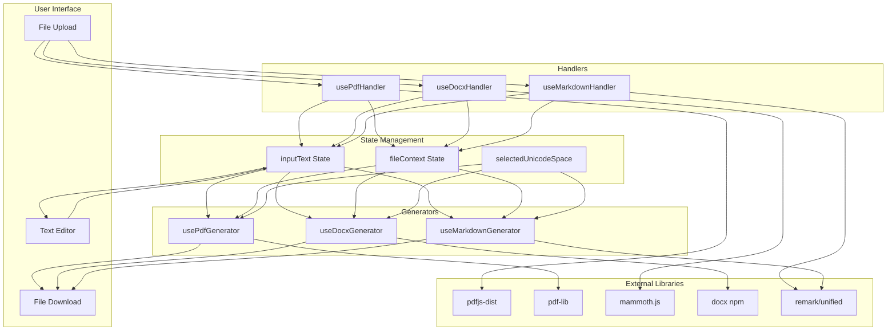

# File Format Support Research Report
## Zero-ZeroGPT: Word (.docx) and Markdown (.md) Implementation

---

## Executive Summary

This comprehensive research report synthesizes findings from three prior research subtasks to provide an actionable implementation plan for adding Word document (.docx) and Markdown (.md) support to Zero-ZeroGPT. The project currently uses a robust Handler/Generator pattern for PDF processing, which can be extended to support additional formats.

**Key Recommendations:**
- **Word Documents**: Use **Mammoth.js** for reading and **docx npm** for generation, with critical attention to `xml:space="preserve"` for Unicode retention
- **Markdown Files**: Use **remark (unified ecosystem)** with AST manipulation via `unist-util-visit` for surgical Unicode space insertion
- **Priority**: Implement Markdown first (lower complexity, ~40% of PDF effort) then Word (~60% of PDF effort)
- **Architecture**: Create a unified file handler abstraction to support future format extensions

---

## Section 1: Executive Summary (Extended)

### Research Conducted
Three research subtasks were completed:
1. **Codebase Analysis** - Documented the existing PDF architecture, Handler/Generator pattern, and integration points
2. **Word Library Research** - Evaluated JavaScript libraries for .docx reading/writing with Unicode support
3. **Markdown Library Research** - Analyzed Markdown parsing libraries for AST-based text manipulation

### Complexity Comparison

| Format | Read Complexity | Write Complexity | Overall Effort | Relative to PDF |
|--------|-----------------|------------------|----------------|-----------------|
| **PDF** (existing) | High | High | Baseline | 100% |
| **Word (.docx)** | Medium | Medium-High | Moderate | ~60% |
| **Markdown (.md)** | Low | Low | Low | ~40% |

### Strategic Recommendation
Markdown should be implemented first as a quick win, followed by Word document support. Both formats can leverage the existing core transformation logic in [`App.js`](src/App.js:69) (`replaceSpaces` function).

---

## Section 2: Current Architecture Analysis

### Existing PDF Architecture Patterns

The current codebase follows a **layered React architecture** with clear separation of concerns:

```
┌─────────────────────────────────────────────────────────────────┐
│                        App.js (UI Layer)                        │
│  ┌──────────────┐  ┌──────────────┐  ┌──────────────────────┐  │
│  │  inputText   │  │ enhancedPdf  │  │ isLayoutPreserved    │  │
│  │   (state)    │  │    Data      │  │      (flag)          │  │
│  └──────────────┘  └──────────────┘  └──────────────────────┘  │
└─────────────────────────────────────────────────────────────────┘
                             │
        ┌────────────────────┼────────────────────┐
        ▼                    ▼                    ▼
┌───────────────┐    ┌───────────────┐    ┌───────────────┐
│ PdfUploader   │    │ replaceSpaces │    │ PdfDownloader │
│  Component    │    │   Function    │    │   Component   │
└───────┬───────┘    └───────────────┘    └───────┬───────┘
        │                                         │
        ▼                                         ▼
┌───────────────┐                         ┌───────────────┐
│ usePdfHandler │                         │usePdfGenerator│
│    (Hook)     │                         │    (Hook)     │
└───────┬───────┘                         └───────┬───────┘
        │                                         │
        ▼                                         ▼
┌───────────────┐                         ┌───────────────┐
│   pdfjs-dist  │                         │    pdf-lib    │
│  (Extraction) │                         │  (Generation) │
└───────────────┘                         └───────────────┘
```

### Key Data Structures (from [`pdfTypes.js`](src/utils/pdfTypes.js))

The [`ExtractedPdfData`](src/utils/pdfTypes.js:1) structure is the cornerstone for layout preservation:

```javascript
// Existing structure - to be generalized
{
  metadata: { title, author, pageCount },
  fonts: Map<string, FontData>,
  pages: [{
    layout: { width, height, margins },
    textItems: [{
      text: string,
      x: number,
      y: number,
      fontSize: number,
      fontName: string,
      color: { r, g, b },
      transform: number[],
      charOffsetStart: number,
      charOffsetEnd: number
    }]
  }]
}
```

### Reusable Components and Patterns

| Component/Pattern | Location | Reusability |
|-------------------|----------|-------------|
| Handler Hook Pattern | [`usePdfHandler.js`](src/hooks/usePdfHandler.js) | **Template for new handlers** |
| Generator Hook Pattern | [`usePdfGenerator.js`](src/hooks/usePdfGenerator.js) | **Template for new generators** |
| `replaceSpaces()` function | [`App.js`](src/App.js:69) | **Core logic - fully reusable** |
| [`fontLoader.js`](src/utils/fontLoader.js) | Utils | Reusable for Word (font embedding) |
| [`fontManager.js`](src/utils/fontManager.js) | Utils | Reusable for Unicode support |
| Component UI pattern | [`PdfUploader.jsx`](src/components/PdfUploader.jsx) / [`PdfDownloader.jsx`](src/components/PdfDownloader.jsx) | Can be generalized |

### Integration Points for New Formats

1. **State Management** ([`App.js`](src/App.js)) - Currently PDF-specific, needs abstraction
2. **Input Mode Selector** - Add "Word" and "Markdown" options
3. **Hook Registration** - New handlers/generators follow same API pattern
4. **Unicode Font Support** - Existing [`fontLoader.js`](src/utils/fontLoader.js) can be shared

---

## Section 3: Word Document (.docx) Implementation Plan

### Recommended Libraries

| Purpose | Library | Version | Justification |
|---------|---------|---------|---------------|
| **Reading** | `mammoth` | ^1.6.0 | Best for clean text extraction, semantic HTML conversion, excellent Unicode UTF-8 support |
| **Writing** | `docx` | ^8.5.0 | Industry standard, explicit `xmlSpace: "preserve"` support critical for Unicode spaces |
| **Download** | `file-saver` | ^2.0.5 | Cross-browser blob download (already may be used) |

### Architecture Proposal

Following the existing Handler/Generator pattern:

```
┌─────────────────────────────────────────────────────────────────┐
│                     Word Document Flow                          │
└─────────────────────────────────────────────────────────────────┘

┌─────────────┐     ┌─────────────────┐     ┌────────────────────┐
│  .docx File │────▶│ DocxUploader.jsx│────▶│   useDocxHandler   │
│   (Input)   │     │   (Component)   │     │      (Hook)        │
└─────────────┘     └─────────────────┘     └─────────┬──────────┘
                                                      │
                                                      ▼
                                            ┌─────────────────────┐
                                            │   mammoth.js        │
                                            │ extractRawText()    │
                                            └─────────┬───────────┘
                                                      │
                                                      ▼
                    ┌─────────────────────────────────────────────┐
                    │              App.js State                   │
                    │  ┌─────────────┐  ┌──────────────────────┐ │
                    │  │  inputText  │  │ fileContext.type=docx│ │
                    │  └──────┬──────┘  └──────────────────────┘ │
                    └─────────┼───────────────────────────────────┘
                              │
                              ▼
                    ┌─────────────────────┐
                    │  replaceSpaces()    │
                    │  (Core Transform)   │
                    └─────────┬───────────┘
                              │
                              ▼
┌─────────────┐     ┌─────────────────────┐     ┌──────────────────┐
│  .docx File │◀────│ DocxDownloader.jsx  │◀────│ useDocxGenerator │
│  (Output)   │     │    (Component)      │     │     (Hook)       │
└─────────────┘     └─────────────────────┘     └────────┬─────────┘
                                                         │
                                                         ▼
                                               ┌─────────────────────┐
                                               │   docx npm library  │
                                               │  TextRun + xmlSpace │
                                               └─────────────────────┘
```

### Key Technical Considerations

#### 1. Unicode Space Preservation (CRITICAL)

The `xml:space="preserve"` attribute is **mandatory** for Unicode spaces to survive Word's XML parser:

```javascript
// In useDocxGenerator.js
import { Document, Packer, Paragraph, TextRun } from "docx";

const generateDocx = async (transformedText) => {
  const paragraphs = transformedText.split('\n').map(line => 
    new Paragraph({
      children: [
        new TextRun({
          text: line,
          xmlSpace: "preserve",  // CRITICAL: Prevents space collapsing
          font: "Arial"          // Safe Unicode-supporting font
        })
      ]
    })
  );

  const doc = new Document({
    sections: [{ children: paragraphs }]
  });

  return await Packer.toBlob(doc);
};
```

#### 2. Font Support Considerations

- Word relies on **system fonts**, unlike PDF which requires embedding
- Arial, Calibri, Times New Roman support common Unicode spaces (U+200B, U+2009)
- Zero Width Space (U+200B) and Thin Space (U+2009) are well-supported
- Rare characters may show "tofu" (boxes) if font lacks glyph

#### 3. Layout Preservation Limitations

Unlike PDF, **exact layout preservation is not feasible** with Word documents:
- Mammoth extracts semantic structure, not pixel coordinates
- The approach is: "read content → transform → create new document"
- Original formatting (fonts, styles) can be partially preserved via HTML conversion

### Proposed File Structure

```
src/
├── components/
│   ├── DocxUploader.jsx          # NEW - Upload component
│   └── DocxDownloader.jsx        # NEW - Download component
├── hooks/
│   ├── useDocxHandler.js         # NEW - Reading hook
│   └── useDocxGenerator.js       # NEW - Generation hook
└── utils/
    └── docxTypes.js              # NEW - Type definitions (optional)
```

### Hook API Design

```javascript
// useDocxHandler.js - API matching usePdfHandler
const useDocxHandler = () => {
  const [isExtracting, setIsExtracting] = useState(false);
  const [error, setError] = useState(null);

  const extractText = async (file) => {
    // Returns { rawText: string, previewHtml?: string }
  };

  return { extractText, isExtracting, error };
};

// useDocxGenerator.js - API matching usePdfGenerator  
const useDocxGenerator = () => {
  const [isGenerating, setIsGenerating] = useState(false);
  const [error, setError] = useState(null);

  const generateDocument = async (text, filename) => {
    // Creates and downloads .docx blob
  };

  return { generateDocument, isGenerating, error };
};
```

### Risk Assessment

| Risk | Severity | Likelihood | Mitigation |
|------|----------|------------|------------|
| Unicode spaces collapsed by Word | High | Medium | Always use `xmlSpace: "preserve"` |
| Font doesn't render special chars | Medium | Low | Default to Arial/Calibri |
| Large file performance | Medium | Low | Stream processing, show progress |
| Original formatting lost | Low | High | Accept semantic-only preservation |

### Effort Estimate

- **Handler Hook**: Small (S) - ~2-4 hours
- **Generator Hook**: Medium (M) - ~4-6 hours  
- **UI Components**: Small (S) - ~2-3 hours
- **Integration & Testing**: Medium (M) - ~4-6 hours
- **Total**: ~12-19 hours (~60% of original PDF implementation)

---

## Section 4: Markdown (.md) Implementation Plan

### Recommended Libraries

| Purpose | Library | Version | Justification |
|---------|---------|---------|---------------|
| **Parsing** | `remark-parse` | ^11.0.0 | Full AST (MDAST), part of unified ecosystem |
| **Transformation** | `unist-util-visit` | ^5.0.0 | Tree traversal for surgical text node modification |
| **Stringification** | `remark-stringify` | ^11.0.0 | Lossless MD → AST → MD roundtrip |
| **Core** | `unified` | ^11.0.0 | Pipeline processor |
| **Preview (optional)** | `react-markdown` | ^9.0.0 | Consistent rendering using remark |

### Architecture Proposal

```
┌─────────────────────────────────────────────────────────────────┐
│                     Markdown File Flow                          │
└─────────────────────────────────────────────────────────────────┘

┌─────────────┐     ┌───────────────────┐     ┌────────────────────┐
│   .md File  │────▶│ MarkdownUploader  │────▶│ useMarkdownHandler │
│   (Input)   │     │   (Component)     │     │      (Hook)        │
└─────────────┘     └───────────────────┘     └─────────┬──────────┘
                                                        │
                                                        ▼
                                              ┌─────────────────────┐
                                              │    FileReader API   │
                                              │    (UTF-8 Text)     │
                                              └─────────┬───────────┘
                                                        │
                                                        ▼
                    ┌─────────────────────────────────────────────┐
                    │              App.js State                   │
                    │  ┌─────────────┐  ┌────────────────────────┐│
                    │  │  inputText  │  │ fileContext.type=md    ││
                    │  └──────┬──────┘  └────────────────────────┘│
                    └─────────┼───────────────────────────────────┘
                              │
                              ▼
                    ┌─────────────────────┐
                    │   AST Transform     │
                    │  (remark + visit)   │
                    └─────────┬───────────┘
                              │
                              ▼
┌─────────────┐     ┌─────────────────────┐     ┌────────────────────┐
│   .md File  │◀────│ MarkdownDownloader  │◀────│useMarkdownGenerator│
│  (Output)   │     │    (Component)      │     │      (Hook)        │
└─────────────┘     └─────────────────────┘     └─────────┬──────────┘
                                                          │
                                                          ▼
                                                ┌─────────────────────┐
                                                │   Blob Download     │
                                                │  (text/markdown)    │
                                                └─────────────────────┘
```

### AST Transformation Pipeline

The key innovation is **AST-based transformation** to avoid breaking Markdown syntax:

```
Input: "# Hello World\n\nThis is a [link](url)."
                          │
                          ▼
┌─────────────────────────────────────────────────────────────────┐
│                        MDAST Tree                               │
│  root                                                           │
│  ├── heading (depth: 1)                                        │
│  │   └── text: "Hello World"           ◀── TRANSFORM THIS      │
│  └── paragraph                                                  │
│      ├── text: "This is a "            ◀── TRANSFORM THIS      │
│      ├── link (url: "url")             ◀── DO NOT TRANSFORM    │
│      │   └── text: "link"              ◀── TRANSFORM THIS      │
│      └── text: "."                     ◀── TRANSFORM THIS      │
└─────────────────────────────────────────────────────────────────┘
                          │
                          ▼
Output: "# Hello[U+2009]World\n\nThis[U+2009]is[U+2009]a[U+2009][link](url)."
```

### Key Technical Considerations

#### 1. Selective Node Transformation

Only `text` nodes should be transformed; URLs, code blocks, and HTML must be preserved:

```javascript
import { unified } from 'unified';
import remarkParse from 'remark-parse';
import remarkStringify from 'remark-stringify';
import { visit } from 'unist-util-visit';

const transformMarkdown = async (markdownText, unicodeSpaceChar) => {
  const processor = unified()
    .use(remarkParse)
    .use(() => (tree) => {
      visit(tree, 'text', (node, index, parent) => {
        // Skip text inside code blocks or inline code
        if (parent?.type === 'code' || parent?.type === 'inlineCode') {
          return;
        }
        // Safe replacement: only affects text content
        node.value = node.value.split(' ').join(unicodeSpaceChar);
      });
    })
    .use(remarkStringify);

  const file = await processor.process(markdownText);
  return String(file);
};
```

#### 2. UTF-8 Handling

```javascript
// Reading: Handle potential BOM
const readMarkdownFile = (file) => {
  return new Promise((resolve) => {
    const reader = new FileReader();
    reader.onload = (e) => {
      let content = e.target.result;
      // Strip UTF-8 BOM if present
      if (content.charCodeAt(0) === 0xFEFF) {
        content = content.slice(1);
      }
      resolve(content);
    };
    reader.readAsText(file, 'UTF-8');
  });
};

// Writing: Ensure UTF-8 blob
const downloadMarkdown = (content, filename) => {
  const blob = new Blob([content], { type: 'text/markdown;charset=utf-8' });
  saveAs(blob, filename);
};
```

#### 3. Whitespace Safety

- Unicode spaces (U+200B, U+2009) are treated as **non-whitespace** by Markdown parsers
- They won't accidentally trigger code blocks or list indentation
- This is **ideal** for Zero-ZeroGPT's evasion purpose

### Proposed File Structure

```
src/
├── components/
│   ├── MarkdownUploader.jsx      # NEW - Upload component
│   └── MarkdownDownloader.jsx    # NEW - Download component  
├── hooks/
│   ├── useMarkdownHandler.js     # NEW - Reading hook
│   └── useMarkdownGenerator.js   # NEW - Generation hook
└── utils/
    └── markdownTransformer.js    # NEW - AST transformation logic
```

### Risk Assessment

| Risk | Severity | Likelihood | Mitigation |
|------|----------|------------|------------|
| Breaking Markdown syntax | High | Low | Use AST transformation, not regex |
| Code blocks modified | Medium | Low | Skip `code` and `inlineCode` nodes |
| Render font issues | Low | Medium | User's editor/viewer responsibility |
| BOM handling | Low | Low | Strip on read |

### Effort Estimate

- **Handler Hook**: Extra Small (XS) - ~1-2 hours
- **Generator Hook**: Small (S) - ~2-3 hours (includes AST logic)
- **UI Components**: Extra Small (XS) - ~1-2 hours
- **Integration & Testing**: Small (S) - ~2-3 hours
- **Total**: ~6-10 hours (~40% of original PDF implementation)

---

## Section 5: Unified Architecture Proposal

### Generalized File Handler Abstraction

To support PDF, Word, Markdown, and future formats cleanly, a unified abstraction is proposed:

```javascript
// Proposed: src/types/fileContext.js
const FileContextSchema = {
  name: '',           // Original filename
  type: '',           // 'pdf' | 'docx' | 'md'
  originalData: null, // Format-specific preserved data
  meta: {
    pageCount: null,  // PDF
    wordCount: null,  // All
    hasLayout: false  // PDF only
  }
};

// Proposed: src/types/fileHandler.js
interface FileHandler {
  extractText: (file: File) => Promise<{ text: string, context: FileContext }>;
  isExtracting: boolean;
  error: string | null;
}

interface FileGenerator {
  generate: (text: string, context: FileContext, filename: string) => Promise<void>;
  isGenerating: boolean;
  error: string | null;
}
```

### Unified Component Architecture

```
┌─────────────────────────────────────────────────────────────────────────────┐
│                            App.js                                           │
│  ┌────────────────────────────────────────────────────────────────────────┐ │
│  │                    Unified State Management                            │ │
│  │  ┌─────────────┐  ┌──────────────┐  ┌───────────────────────────────┐ │ │
│  │  │  inputText  │  │ fileContext  │  │    selectedUnicodeSpace       │ │ │
│  │  └─────────────┘  └──────────────┘  └───────────────────────────────┘ │ │
│  └────────────────────────────────────────────────────────────────────────┘ │
│                                    │                                        │
│         ┌──────────────────────────┼──────────────────────────┐            │
│         ▼                          ▼                          ▼            │
│  ┌─────────────────┐      ┌─────────────────┐      ┌─────────────────┐     │
│  │  FileUploader   │      │  TextTransform  │      │ FileDownloader  │     │
│  │   (Unified)     │      │   (Shared)      │      │   (Unified)     │     │
│  └────────┬────────┘      └─────────────────┘      └────────┬────────┘     │
│           │                                                  │              │
└───────────┼──────────────────────────────────────────────────┼──────────────┘
            │                                                  │
            ▼                                                  ▼
┌─────────────────────────────────────────────────────────────────────────────┐
│                         Handler/Generator Registry                          │
│  ┌───────────────────┐  ┌───────────────────┐  ┌───────────────────┐       │
│  │   PDF Handler     │  │   DOCX Handler    │  │    MD Handler     │       │
│  │  usePdfHandler    │  │  useDocxHandler   │  │ useMarkdownHandler│       │
│  └───────────────────┘  └───────────────────┘  └───────────────────┘       │
│  ┌───────────────────┐  ┌───────────────────┐  ┌───────────────────┐       │
│  │   PDF Generator   │  │   DOCX Generator  │  │    MD Generator   │       │
│  │ usePdfGenerator   │  │ useDocxGenerator  │  │useMarkdownGenerator│      │
│  └───────────────────┘  └───────────────────┘  └───────────────────┘       │
└─────────────────────────────────────────────────────────────────────────────┘
```

### Proposed Shared Utilities

```
src/utils/
├── core/
│   ├── unicodeSpaces.js          # Space character definitions & utilities
│   └── textTransformer.js        # Core replaceSpaces() logic
├── pdf/
│   ├── pdfTypes.js               # (existing)
│   ├── fontLoader.js             # (existing)
│   ├── fontManager.js            # (existing)
│   ├── colorExtractor.js         # (existing)
│   ├── columnDetector.js         # (existing)
│   └── textLayoutEngine.js       # (existing)
├── docx/
│   └── docxUtils.js              # DOCX-specific helpers
└── markdown/
    └── markdownTransformer.js    # AST transformation logic
```

### Handler Factory Pattern (Optional Enhancement)

```javascript
// src/hooks/useFileHandler.js
const useFileHandler = (fileType) => {
  const handlers = {
    pdf: usePdfHandler,
    docx: useDocxHandler,
    md: useMarkdownHandler
  };
  
  return handlers[fileType]();
};

// Usage in App.js
const { extractText, isExtracting, error } = useFileHandler(fileContext.type);
```

---

## Section 6: Implementation Roadmap

### Phased Implementation Approach

```
┌─────────────────────────────────────────────────────────────────────────────┐
│                         IMPLEMENTATION PHASES                               │
└─────────────────────────────────────────────────────────────────────────────┘

Phase 0: Foundation (Pre-requisite)
├── Refactor App.js to use generic fileContext state
├── Extract replaceSpaces() to shared utility
└── Create FileUploader/FileDownloader generic components

Phase 1: Markdown Support (Quick Win) ─────────────────── Target: 1-2 days
├── Install remark dependencies
├── Create useMarkdownHandler hook
├── Create useMarkdownGenerator hook
├── Create MarkdownUploader/Downloader components
├── Wire up to App.js
└── Test with various .md files

Phase 2: Word Support (Core Feature) ──────────────────── Target: 2-3 days
├── Install mammoth + docx dependencies
├── Create useDocxHandler hook
├── Create useDocxGenerator hook
├── Create DocxUploader/Downloader components
├── Implement xmlSpace preservation
├── Wire up to App.js
└── Test Unicode space preservation

Phase 3: Polish & Testing ─────────────────────────────── Target: 1-2 days
├── Add error handling for all formats
├── Add loading states and progress indicators
├── Cross-browser testing
├── Edge case testing (large files, special characters)
└── Documentation updates
```

### Priority Order Recommendation

| Priority | Format | Rationale |
|----------|--------|-----------|
| **1** | Markdown | Lowest complexity, fastest implementation, good for validation |
| **2** | Word | Higher user demand, more complex but manageable |
| **3** | (Future) Plain Text | Trivial, could be bonus feature |

### Dependency Graph

```
┌───────────────────────────────────────────────────────────────┐
│                      DEPENDENCY GRAPH                         │
└───────────────────────────────────────────────────────────────┘

                    ┌──────────────────────┐
                    │   fileContext State  │
                    │    (App.js Refactor) │
                    └──────────┬───────────┘
                               │
            ┌──────────────────┼──────────────────┐
            │                  │                  │
            ▼                  ▼                  ▼
    ┌───────────────┐  ┌───────────────┐  ┌───────────────┐
    │  MD Handler   │  │  DOCX Handler │  │ PDF Handler   │
    │ (remark deps) │  │(mammoth deps) │  │  (existing)   │
    └───────┬───────┘  └───────┬───────┘  └───────────────┘
            │                  │
            ▼                  ▼
    ┌───────────────┐  ┌───────────────┐
    │ MD Generator  │  │DOCX Generator │
    │(remark-string)│  │  (docx npm)   │
    └───────────────┘  └───────────────┘
```

### Testing Strategy

| Format | Test Category | Test Cases |
|--------|---------------|------------|
| **Markdown** | Unit | AST transformation preserves structure |
| | Unit | Code blocks not modified |
| | Unit | Links/URLs not modified |
| | Integration | Upload → Transform → Download roundtrip |
| | E2E | Various .md files from real sources |
| **Word** | Unit | Text extraction accuracy |
| | Unit | xmlSpace preservation |
| | Integration | Upload → Transform → Download roundtrip |
| | E2E | Open in MS Word, verify Unicode spaces |
| **All** | Regression | Existing PDF tests still pass |
| | Performance | Large file handling (>1MB) |

---

## Section 7: Package Dependencies

### New Dependencies to Add

```json
{
  "dependencies": {
    // Markdown Support
    "unified": "^11.0.4",
    "remark-parse": "^11.0.0",
    "remark-stringify": "^11.0.0",
    "unist-util-visit": "^5.0.0",
    
    // Word Support
    "mammoth": "^1.6.0",
    "docx": "^8.5.0",
    
    // Shared (may already exist)
    "file-saver": "^2.0.5"
  },
  "devDependencies": {
    // Optional: Preview
    "react-markdown": "^9.0.1"
  }
}
```

### Bundle Size Impact Analysis

| Package | Minified Size | Gzipped | Tree-shakable |
|---------|---------------|---------|---------------|
| `unified` | ~15KB | ~5KB | Yes |
| `remark-parse` | ~45KB | ~15KB | Yes |
| `remark-stringify` | ~25KB | ~8KB | Yes |
| `unist-util-visit` | ~3KB | ~1KB | Yes |
| `mammoth` | ~180KB | ~55KB | Partial |
| `docx` | ~300KB | ~85KB | Yes |
| `file-saver` | ~10KB | ~3KB | Yes |
| **Total New** | ~578KB | ~172KB | - |

**Impact Assessment**: 
- Current bundle (estimated): ~800KB (with PDF libs)
- New total (estimated): ~1.4MB
- Increase: ~75%
- **Mitigation**: Code-splitting per format; lazy-load Word/MD modules

### Version Compatibility

| Package | Min Node | Browser Support | React Compat |
|---------|----------|-----------------|--------------|
| unified | 16+ | Modern | All |
| mammoth | 12+ | IE10+, Chrome, FF | All |
| docx | 14+ | Modern | All |

### Breaking Changes & Concerns

1. **mammoth**: No known breaking changes in 1.x line
2. **docx**: v8 had API changes from v7; use v8+ for `xmlSpace` support
3. **unified v11**: ESM-only; ensure bundler configured for ESM

---

## Section 8: Risk Assessment

### Technical Risks Matrix

| Risk ID | Risk Description | Format | Severity | Likelihood | Impact | Mitigation Strategy |
|---------|------------------|--------|----------|------------|--------|---------------------|
| R1 | Unicode spaces collapsed by Word | DOCX | Critical | Medium | High | Always use `xmlSpace: "preserve"`; test in multiple Word versions |
| R2 | AST transformation breaks MD syntax | MD | High | Low | Medium | Comprehensive unit tests; skip non-text nodes |
| R3 | Large file causes browser hang | All | Medium | Medium | Medium | Implement chunked processing; add progress indicator |
| R4 | Font doesn't render Unicode chars | DOCX | Medium | Low | Low | Default to Arial/Calibri; document limitation |
| R5 | BOM causes parsing errors | MD | Low | Low | Low | Strip BOM on file read |
| R6 | Bundle size too large | All | Medium | High | Medium | Implement code splitting; lazy load format modules |
| R7 | ESM/CJS module conflicts | All | Medium | Medium | High | Ensure Webpack/Vite configured for unified ESM |

### Fallback Options

| Scenario | Primary Approach | Fallback |
|----------|------------------|----------|
| Word Unicode fails | `docx` with xmlSpace | Export as plain text with .txt extension |
| Markdown AST complex | remark transformation | Simple regex (degraded, warn user) |
| Large file timeout | Client-side processing | Suggest splitting file |
| Bundle too large | Lazy loading | Offer "lightweight mode" without Word |

### Success Criteria Checklist

- [ ] Markdown files can be uploaded and text extracted
- [ ] Markdown files can be generated with Unicode spaces preserved
- [ ] Word files can be uploaded and text extracted  
- [ ] Word files can be generated with Unicode spaces preserved
- [ ] Unicode spaces survive Word's XML parser (xmlSpace)
- [ ] Existing PDF functionality unaffected (regression tests pass)
- [ ] Bundle size increase < 100% (or code-split implemented)
- [ ] All three formats work in Chrome, Firefox, Safari, Edge

---

## Appendix A: Mermaid Architecture Diagram



---

## Appendix B: File Structure Summary

```
src/
├── App.js                          # Refactored with fileContext
├── components/
│   ├── PdfUploader.jsx             # (existing)
│   ├── PdfDownloader.jsx           # (existing)
│   ├── DocxUploader.jsx            # NEW
│   ├── DocxDownloader.jsx          # NEW
│   ├── MarkdownUploader.jsx        # NEW
│   ├── MarkdownDownloader.jsx      # NEW
│   └── FileUploader.jsx            # NEW (optional unified component)
├── hooks/
│   ├── usePdfHandler.js            # (existing)
│   ├── usePdfGenerator.js          # (existing)
│   ├── useDocxHandler.js           # NEW
│   ├── useDocxGenerator.js         # NEW
│   ├── useMarkdownHandler.js       # NEW
│   └── useMarkdownGenerator.js     # NEW
├── utils/
│   ├── core/
│   │   ├── unicodeSpaces.js        # NEW - Extracted from App.js
│   │   └── textTransformer.js      # NEW - Core logic
│   ├── pdf/                        # (existing files moved)
│   │   ├── pdfTypes.js
│   │   ├── fontLoader.js
│   │   ├── fontManager.js
│   │   ├── colorExtractor.js
│   │   ├── columnDetector.js
│   │   └── textLayoutEngine.js
│   ├── docx/
│   │   └── docxUtils.js            # NEW
│   └── markdown/
│       └── markdownTransformer.js  # NEW
└── types/                          # NEW (optional)
    └── fileContext.js
```

---

## Appendix C: Quick Reference Commands

```bash
# Install all new dependencies
npm install unified remark-parse remark-stringify unist-util-visit mammoth docx file-saver

# Install dev dependencies (optional preview)
npm install --save-dev react-markdown

# Verify installation
npm ls unified mammoth docx
```

---

*Report generated: 2024*
*Research synthesized from: CODEBASE_ANALYSIS.md, WORD_LIBRARY_RESEARCH.md, MARKDOWN_LIBRARY_RESEARCH.md*