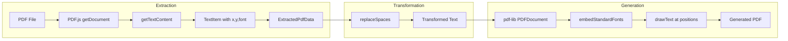
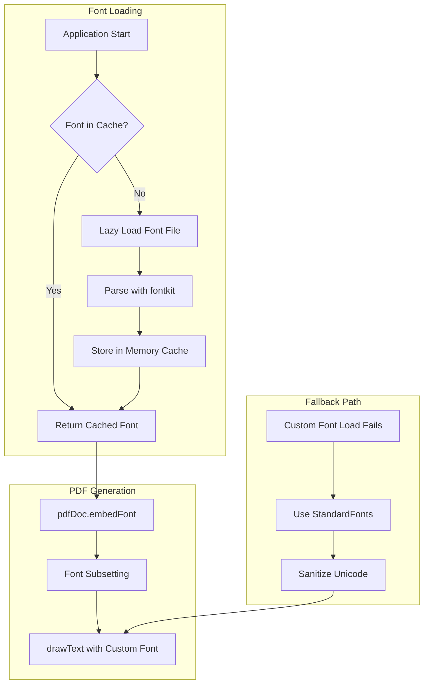
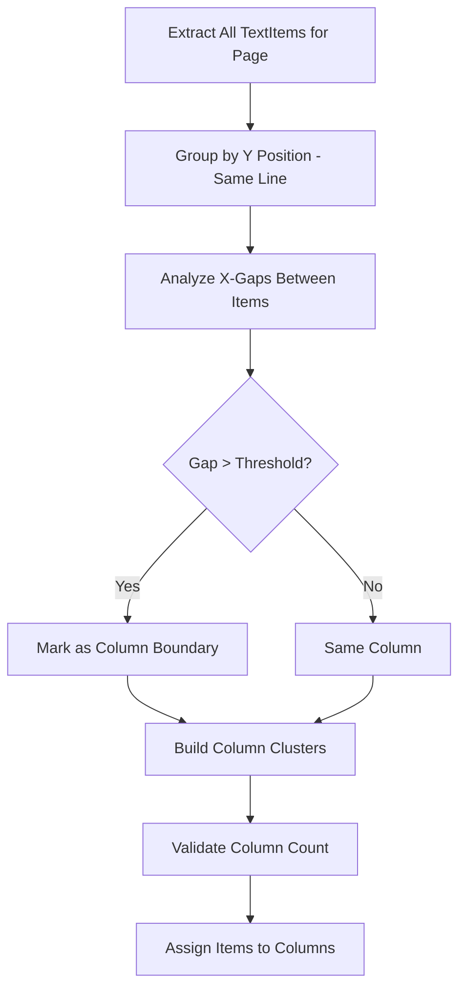
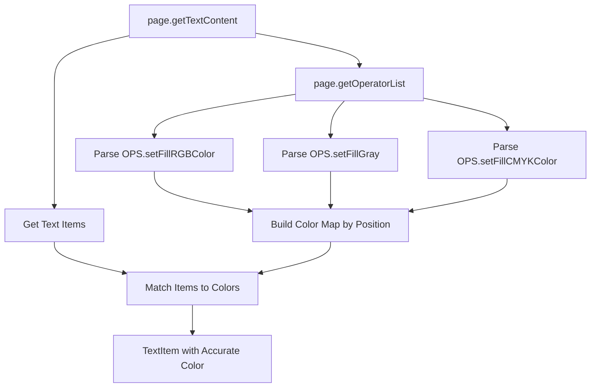
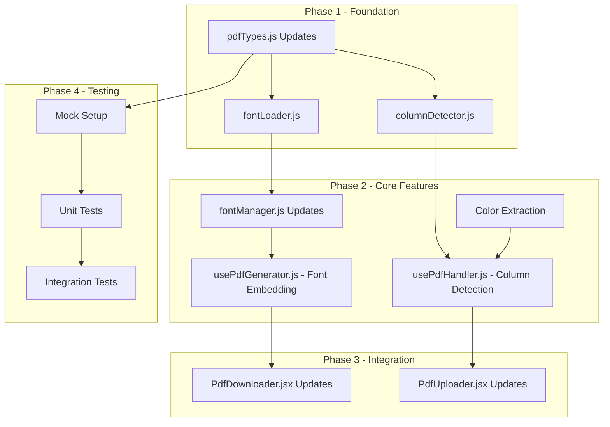

# PDF Enhancements Architecture Document

## Executive Summary

This architecture document provides a comprehensive technical design for implementing 4 new PDF features in the Zero-ZeroGPT application: **Custom Font Embedding** (for wider Unicode coverage), **Column Detection** (for multi-column layouts), **Color Preservation** (extract and apply text colors), and **Testing** (unit tests for PDF functions). The design builds upon the existing PDF infrastructure that uses PDF.js for extraction and pdf-lib with fontkit for generation, extending it with new capabilities while maintaining backward compatibility.

---

## Table of Contents

1. [Current Implementation Analysis](#1-current-implementation-analysis)
2. [Feature 1: Custom Font Embedding](#2-feature-1-custom-font-embedding)
3. [Feature 2: Column Detection](#3-feature-2-column-detection)
4. [Feature 3: Color Preservation](#4-feature-3-color-preservation)
5. [Feature 4: Testing Strategy](#5-feature-4-testing-strategy)
6. [Dependency Graph & Implementation Order](#6-dependency-graph--implementation-order)
7. [Complexity & Bundle Size Impact](#7-complexity--bundle-size-impact)
8. [Risk Assessment & Mitigation](#8-risk-assessment--mitigation)
9. [File Change Summary](#9-file-change-summary)

---

## 1. Current Implementation Analysis

### 1.1 Existing File Structure

| File | Purpose | Lines | Key Exports |
|------|---------|-------|-------------|
| [`src/utils/pdfTypes.js`](../src/utils/pdfTypes.js) | Type definitions and utilities | 374 | TextItem, PageLayout, FontInfo, ExtractedPdfData |
| [`src/utils/fontManager.js`](../src/utils/fontManager.js) | Font detection and fallback | 414 | FontManager class, standard font mappings |
| [`src/hooks/usePdfHandler.js`](../src/hooks/usePdfHandler.js) | PDF extraction with PDF.js | 460 | extractPdfWithLayout, extractTextFromPdf |
| [`src/hooks/usePdfGenerator.js`](../src/hooks/usePdfGenerator.js) | PDF generation with pdf-lib | 627 | generatePdfWithLayout, embedStandardFonts |
| [`src/components/PdfUploader.jsx`](../src/components/PdfUploader.jsx) | Upload UI component | 417 | PdfUploader component |
| [`src/components/PdfDownloader.jsx`](../src/components/PdfDownloader.jsx) | Download UI component | 390 | PdfDownloader component |
| [`src/App.js`](../src/App.js) | Main application | 790 | App component with PDF integration |

### 1.2 Current Data Flow



### 1.3 Current Capabilities and Gaps

| Capability | Current State | Gap |
|------------|---------------|-----|
| Font Embedding | StandardFonts only (Helvetica, Times, Courier) | No custom font support, limited Unicode |
| Column Detection | Not implemented | Multi-column PDFs render as single column |
| Color Extraction | Attempted via `styles.fillColor` (unreliable) | Colors often default to black |
| Testing | Jest configured, no test files | No test coverage |

### 1.4 Current TextItem Structure (from [`pdfTypes.js:33-55`](../src/utils/pdfTypes.js:33))

```javascript
{
  text: string,           // The text string
  x: number,              // X position (PDF points)
  y: number,              // Y position (PDF points)  
  width: number,          // Text width
  height: number,         // Text height
  fontSize: number,       // Font size from transform
  fontName: string,       // PDF internal font reference
  fontStyle: string,      // 'normal'|'bold'|'italic'|'bolditalic'
  pageIndex: number,      // Zero-based page index
  transform: number[],    // 6-element transform matrix
  color: { r, g, b },     // RGB color (0-1 range) - CURRENTLY UNRELIABLE
  charOffsetStart: number, // Start index for text mapping
  charOffsetEnd: number    // End index for text mapping
}
```

---

## 2. Feature 1: Custom Font Embedding

### 2.1 Overview

Enable embedding of custom fonts (specifically Noto Sans) for wider Unicode character support, replacing the current WinAnsi sanitization approach that loses Unicode spaces.

### 2.2 Font Selection: Noto Sans

**Recommended Font:** [Noto Sans](https://fonts.google.com/noto/specimen/Noto+Sans)

| Criteria | Value |
|----------|-------|
| **License** | Open Font License (OFL) - free for embedding |
| **Unicode Coverage** | Latin, Latin Extended, Greek, Cyrillic, and Unicode spaces |
| **File Size (Regular)** | ~550KB full, ~100-150KB Latin subset |
| **Weights Available** | Regular, Bold, Italic, Bold Italic |
| **Format** | TTF (required for pdf-lib + fontkit) |

**Why Noto Sans:**
1. Specifically designed for Unicode coverage
2. Includes all Unicode space characters used by the application
3. Professional, neutral appearance suitable for document recreation
4. Actively maintained by Google
5. TTF format works with pdf-lib/fontkit

### 2.3 Architecture Design



### 2.4 File Structure for Fonts

```
src/
├── assets/
│   └── fonts/
│       ├── NotoSans-Regular.ttf      # ~180KB (Latin + Unicode spaces subset)
│       ├── NotoSans-Bold.ttf         # ~180KB (optional)
│       ├── NotoSans-Italic.ttf       # ~180KB (optional)
│       └── NotoSans-BoldItalic.ttf   # ~180KB (optional)
└── utils/
    └── fontLoader.js                  # NEW: Font loading and caching
```

### 2.5 New Module: fontLoader.js

**File:** `src/utils/fontLoader.js` (NEW)

```javascript
/**
 * @module fontLoader
 * @description Lazy loading and caching for custom font files
 */

// Memory cache for loaded fonts
const fontCache = new Map();

/**
 * @typedef {Object} FontBundle
 * @property {Uint8Array} regular - Regular weight font bytes
 * @property {Uint8Array|null} bold - Bold weight font bytes (optional)
 * @property {Uint8Array|null} italic - Italic weight font bytes (optional)
 * @property {Uint8Array|null} boldItalic - Bold italic font bytes (optional)
 */

/**
 * Load Noto Sans font bytes with caching
 * @param {'regular'|'bold'|'italic'|'boldItalic'} [weight='regular'] - Font weight
 * @returns {Promise<Uint8Array|null>} Font bytes or null on failure
 */
export async function loadNotoSansFont(weight = 'regular');

/**
 * Preload fonts for faster PDF generation
 * @returns {Promise<void>}
 */
export async function preloadFonts();

/**
 * Clear the font cache to free memory
 */
export function clearFontCache();

/**
 * Check if fonts are loaded
 * @returns {boolean}
 */
export function areFontsLoaded();
```

### 2.6 Changes to fontManager.js

Add custom font support to the existing [`FontManager`](../src/utils/fontManager.js:145) class:

```javascript
// NEW: Custom font registry
const CUSTOM_FONTS = {
  'NotoSans': {
    regular: 'NotoSans-Regular.ttf',
    bold: 'NotoSans-Bold.ttf',
    italic: 'NotoSans-Italic.ttf',
    boldItalic: 'NotoSans-BoldItalic.ttf'
  }
};

// NEW method in FontManager class
/**
 * Get custom font bytes for embedding
 * @param {string} fontFamily - Font family name
 * @param {'normal'|'bold'|'italic'|'bolditalic'} style - Font style
 * @returns {Promise<Uint8Array|null>} Font bytes or null
 */
async getCustomFontBytes(fontFamily, style);

/**
 * Check if a custom font is available
 * @param {string} fontFamily - Font family name
 * @returns {boolean}
 */
hasCustomFont(fontFamily);
```

### 2.7 Changes to usePdfGenerator.js

Update [`fetchUnicodeFont()`](../src/hooks/usePdfGenerator.js:16-29) to actually load fonts:

```javascript
import { loadNotoSansFont } from '../utils/fontLoader';

/**
 * Load Unicode-capable font for embedding
 * @returns {Promise<Uint8Array|null>} Font bytes or null
 */
const fetchUnicodeFont = async () => {
  try {
    const fontBytes = await loadNotoSansFont('regular');
    if (fontBytes) {
      console.log('Loaded Noto Sans for Unicode support');
      return fontBytes;
    }
  } catch (err) {
    console.warn('Failed to load Noto Sans:', err.message);
  }
  return null;
};
```

Update [`embedStandardFonts()`](../src/hooks/usePdfGenerator.js:266-314) to prioritize custom fonts:

```javascript
const embedFontsWithUnicodeSupport = async (pdfDoc, fonts) => {
  const embeddedFonts = new Map();
  
  // Try to load and embed Noto Sans first
  const notoBytes = await loadNotoSansFont('regular');
  
  if (notoBytes) {
    try {
      const notoFont = await pdfDoc.embedFont(notoBytes, { subset: true });
      embeddedFonts.set('__default__', notoFont);
      embeddedFonts.set('__unicode__', notoFont);
      
      // Map all source fonts to Noto Sans for consistent Unicode support
      for (const [fontId] of fonts.entries()) {
        embeddedFonts.set(fontId, notoFont);
      }
      
      return { fonts: embeddedFonts, hasUnicodeSupport: true };
    } catch (err) {
      console.warn('Failed to embed Noto Sans:', err);
    }
  }
  
  // Fallback to StandardFonts (existing logic)
  return embedStandardFonts(pdfDoc, fonts);
};
```

### 2.8 Bundle Size Optimization

| Strategy | Size Reduction | Implementation |
|----------|----------------|----------------|
| Font Subsetting at Build | ~70% | Include only Latin + Unicode spaces |
| Lazy Loading | 0 initial | Load font only when PDF generated |
| Single Weight | ~70% | Only Regular, derive Bold via pdf-lib |
| Dynamic Import | 0 initial | Use `import()` for font module |

**Recommended Approach:** Use a pre-subsetted Noto Sans Regular (~150KB) with lazy loading.

```javascript
// Lazy load font only when needed
const loadNotoSansFont = async (weight = 'regular') => {
  if (fontCache.has(weight)) {
    return fontCache.get(weight);
  }
  
  const fontModule = await import('../assets/fonts/NotoSans-Regular.ttf');
  const response = await fetch(fontModule.default);
  const bytes = new Uint8Array(await response.arrayBuffer());
  
  fontCache.set(weight, bytes);
  return bytes;
};
```

---

## 3. Feature 2: Column Detection

### 3.1 Overview

Implement multi-column layout detection to properly handle documents like research papers, newspapers, and magazines where text flows in multiple columns.

### 3.2 Column Detection Algorithm

The algorithm analyzes horizontal text item positions to identify column boundaries:



### 3.3 Data Structure Extensions

Add to [`pdfTypes.js`](../src/utils/pdfTypes.js):

```javascript
/**
 * @typedef {Object} ColumnInfo
 * @description Detected column in a page layout
 * @property {number} index - Zero-based column index (left to right)
 * @property {number} leftBound - Left edge X position (PDF points)
 * @property {number} rightBound - Right edge X position (PDF points)
 * @property {number} width - Column width
 * @property {number} gapToNext - Gap to next column (0 if last)
 */

/**
 * @typedef {Object} ColumnLayout
 * @description Multi-column layout information for a page
 * @property {number} columnCount - Number of detected columns (1-4)
 * @property {ColumnInfo[]} columns - Column definitions
 * @property {number} gutterWidth - Average gap between columns
 * @property {boolean} isMultiColumn - True if more than 1 column detected
 */

/**
 * Creates default single-column layout
 * @param {number} pageWidth - Page width in points
 * @returns {ColumnLayout}
 */
export function createDefaultColumnLayout(pageWidth) {
  return {
    columnCount: 1,
    columns: [{
      index: 0,
      leftBound: 0,
      rightBound: pageWidth,
      width: pageWidth,
      gapToNext: 0
    }],
    gutterWidth: 0,
    isMultiColumn: false
  };
}
```

Update `PageLayout` to include column info:

```javascript
/**
 * @typedef {Object} PageLayout
 * @property {number} width
 * @property {number} height
 * @property {PageMargins} margins
 * @property {number} pageIndex
 * @property {ColumnLayout} columnLayout - NEW: Detected column structure
 */
```

Update `TextItem` to include column assignment:

```javascript
/**
 * @typedef {Object} TextItem
 * ...existing properties...
 * @property {number} columnIndex - NEW: Assigned column (0-based, -1 if unassigned)
 */
```

### 3.4 New Module: columnDetector.js

**File:** `src/utils/columnDetector.js` (NEW)

```javascript
/**
 * @module columnDetector
 * @description Multi-column layout detection from text positions
 */

import { createDefaultColumnLayout } from './pdfTypes';

/**
 * Configuration for column detection
 * @typedef {Object} ColumnDetectionConfig
 * @property {number} minColumnWidth - Minimum column width (default: 100pt)
 * @property {number} minGutterWidth - Minimum gap to consider column break (default: 20pt)
 * @property {number} maxColumns - Maximum columns to detect (default: 4)
 * @property {number} minItemsPerColumn - Minimum items for valid column (default: 5)
 */

const DEFAULT_CONFIG = {
  minColumnWidth: 100,
  minGutterWidth: 20,
  maxColumns: 4,
  minItemsPerColumn: 5
};

/**
 * Detect column layout from text items on a page
 * @param {import('./pdfTypes').TextItem[]} textItems - Text items from one page
 * @param {number} pageWidth - Page width in points
 * @param {ColumnDetectionConfig} [config] - Detection configuration
 * @returns {import('./pdfTypes').ColumnLayout} Detected column layout
 */
export function detectColumns(textItems, pageWidth, config = DEFAULT_CONFIG) {
  if (!textItems || textItems.length < config.minItemsPerColumn * 2) {
    return createDefaultColumnLayout(pageWidth);
  }
  
  // Step 1: Collect all unique X positions (left edges)
  const xPositions = textItems.map(item => item.x).sort((a, b) => a - b);
  
  // Step 2: Find significant gaps (potential column boundaries)
  const gaps = [];
  for (let i = 1; i < xPositions.length; i++) {
    const gap = xPositions[i] - xPositions[i - 1];
    if (gap >= config.minGutterWidth) {
      gaps.push({
        position: (xPositions[i] + xPositions[i - 1]) / 2,
        width: gap
      });
    }
  }
  
  // Step 3: Cluster gaps to find consistent column boundaries
  const boundaries = clusterGaps(gaps, pageWidth, config);
  
  // Step 4: Build column definitions
  const columns = buildColumns(boundaries, pageWidth, config);
  
  return {
    columnCount: columns.length,
    columns,
    gutterWidth: calculateAverageGutter(columns),
    isMultiColumn: columns.length > 1
  };
}

/**
 * Assign text items to detected columns
 * @param {import('./pdfTypes').TextItem[]} textItems - Text items to assign
 * @param {import('./pdfTypes').ColumnLayout} columnLayout - Detected layout
 * @returns {import('./pdfTypes').TextItem[]} Items with columnIndex assigned
 */
export function assignItemsToColumns(textItems, columnLayout) {
  return textItems.map(item => {
    const columnIndex = findColumnForPosition(item.x, columnLayout.columns);
    return { ...item, columnIndex };
  });
}

/**
 * Sort text items in reading order (column by column, top to bottom)
 * @param {import('./pdfTypes').TextItem[]} textItems - Items with columnIndex
 * @returns {import('./pdfTypes').TextItem[]} Sorted items
 */
export function sortByReadingOrder(textItems) {
  return [...textItems].sort((a, b) => {
    // First by column
    if (a.columnIndex !== b.columnIndex) {
      return a.columnIndex - b.columnIndex;
    }
    // Then by Y position (top to bottom, PDF Y is bottom-up so reverse)
    if (Math.abs(a.y - b.y) > 5) {
      return b.y - a.y;
    }
    // Finally by X position
    return a.x - b.x;
  });
}

// Helper functions (implementations)
function clusterGaps(gaps, pageWidth, config) { /* ... */ }
function buildColumns(boundaries, pageWidth, config) { /* ... */ }
function calculateAverageGutter(columns) { /* ... */ }
function findColumnForPosition(x, columns) { /* ... */ }
```

### 3.5 Integration with usePdfHandler.js

Update [`extractPdfWithLayout()`](../src/hooks/usePdfHandler.js:173-406) to detect columns:

```javascript
import { detectColumns, assignItemsToColumns } from '../utils/columnDetector';

// After extracting text items for a page (around line 334):
const pageTextItems = textItemsByPage.get(pageIndex) || [];

// NEW: Detect columns for this page
const columnLayout = detectColumns(pageTextItems, viewport.width);
pageLayout.columnLayout = columnLayout;

// NEW: Assign items to columns
const itemsWithColumns = assignItemsToColumns(pageTextItems, columnLayout);

// Store the column-assigned items
extractedData.textItems.push(...itemsWithColumns);
```

### 3.6 Integration with usePdfGenerator.js

Update generation to respect column order:

```javascript
import { sortByReadingOrder } from '../utils/columnDetector';

// In generatePdfWithLayout, before rendering:
const sortedItems = pageLayout.columnLayout?.isMultiColumn
  ? sortByReadingOrder(pageTextItems)
  : pageTextItems;

// Render in sorted order
for (const item of sortedItems) {
  // ... existing drawText logic
}
```

---

## 4. Feature 3: Color Preservation

### 4.1 Overview

Improve text color extraction from source PDFs using PDF.js APIs and ensure colors are correctly applied in generated PDFs.

### 4.2 Current Color Extraction Issue

The current implementation at [`usePdfHandler.js:291-300`](../src/hooks/usePdfHandler.js:291-300) attempts to extract color from `textContent.styles[fontName].fillColor`, but this is often not available:

```javascript
// Current (unreliable) approach
if (textContent.styles && item.fontName && textContent.styles[item.fontName]) {
  const style = textContent.styles[item.fontName];
  if (style.fillColor) {  // Often undefined!
    textItem.color = { r: style.fillColor[0], g: style.fillColor[1], b: style.fillColor[2] };
  }
}
```

### 4.3 PDF.js Color Extraction Methods

PDF.js provides multiple ways to access color information:

| Method | Reliability | Complexity | Description |
|--------|-------------|------------|-------------|
| `textContent.styles.fillColor` | Low | Low | Sometimes available, often undefined |
| `page.getOperatorList()` | High | High | Full rendering commands with colors |
| `page.render()` with SVG | Medium | Medium | Render to SVG, parse fill attributes |
| Text annotations | Low | Low | Only for annotated text |

**Recommended Approach:** Use `getOperatorList()` for reliable color extraction.

### 4.4 Enhanced Color Extraction Architecture



### 4.5 New Color Extraction Function

Add to `usePdfHandler.js`:

```javascript
/**
 * Extract text colors from a PDF page using operator list
 * @param {PDFPageProxy} page - PDF.js page object
 * @returns {Promise<Map<string, {r: number, g: number, b: number}>>} Map of position key to color
 */
async function extractTextColors(page) {
  const colorMap = new Map();
  const operatorList = await page.getOperatorList();
  
  let currentColor = { r: 0, g: 0, b: 0 }; // Default black
  let currentTransform = [1, 0, 0, 1, 0, 0];
  
  const OPS = pdfjsLib.OPS;
  
  for (let i = 0; i < operatorList.fnArray.length; i++) {
    const fn = operatorList.fnArray[i];
    const args = operatorList.argsArray[i];
    
    switch (fn) {
      case OPS.setFillRGBColor:
        currentColor = { r: args[0], g: args[1], b: args[2] };
        break;
      
      case OPS.setFillGray:
        currentColor = { r: args[0], g: args[0], b: args[0] };
        break;
      
      case OPS.setFillCMYKColor:
        // Convert CMYK to RGB
        const [c, m, y, k] = args;
        currentColor = {
          r: (1 - c) * (1 - k),
          g: (1 - m) * (1 - k),
          b: (1 - y) * (1 - k)
        };
        break;
      
      case OPS.setTextMatrix:
        currentTransform = args;
        break;
      
      case OPS.showText:
      case OPS.showSpacedText:
        // Store color for this text position
        const posKey = `${Math.round(currentTransform[4])}_${Math.round(currentTransform[5])}`;
        colorMap.set(posKey, { ...currentColor });
        break;
    }
  }
  
  return colorMap;
}

/**
 * Match text item to extracted color
 * @param {TextItem} item - Text item to match
 * @param {Map<string, Object>} colorMap - Extracted colors by position
 * @returns {{r: number, g: number, b: number}} Matched color or default black
 */
function matchColorToItem(item, colorMap) {
  const posKey = `${Math.round(item.x)}_${Math.round(item.y)}`;
  
  // Try exact match
  if (colorMap.has(posKey)) {
    return colorMap.get(posKey);
  }
  
  // Try nearby positions (within 2 points)
  for (let dx = -2; dx <= 2; dx++) {
    for (let dy = -2; dy <= 2; dy++) {
      const nearbyKey = `${Math.round(item.x) + dx}_${Math.round(item.y) + dy}`;
      if (colorMap.has(nearbyKey)) {
        return colorMap.get(nearbyKey);
      }
    }
  }
  
  // Default to black
  return { r: 0, g: 0, b: 0 };
}
```

### 4.6 Integration with Extraction Pipeline

Update the page processing loop in [`extractPdfWithLayout()`](../src/hooks/usePdfHandler.js:231-360):

```javascript
// Extract colors for this page
const colorMap = await extractTextColors(page);

// When creating text items (around line 288):
textItem.color = matchColorToItem({
  x: parsed.x,
  y: parsed.y
}, colorMap);
```

### 4.7 Color Application in Generation

The current implementation at [`usePdfGenerator.js:456-460`](../src/hooks/usePdfGenerator.js:456-460) already applies colors:

```javascript
page.drawText(textToRender, {
  x: x,
  y: y,
  size: fontSize,
  font: font,
  color: rgb(color.r, color.g, color.b),  // Already implemented!
});
```

This will work correctly once colors are accurately extracted.

### 4.8 Data Structure Update

The existing [`TextItem.color`](../src/utils/pdfTypes.js:30-33) structure is sufficient:

```javascript
color: {
  r: number,  // 0-1 range
  g: number,  // 0-1 range
  b: number   // 0-1 range
}
```

No changes needed to pdfTypes.js for color.

---

## 5. Feature 4: Testing Strategy

### 5.1 Overview

Add comprehensive unit tests for PDF extraction and generation functions using Jest (already configured via react-scripts).

### 5.2 Testing Framework

| Component | Tool | Status |
|-----------|------|--------|
| Test Runner | Jest | Configured via react-scripts |
| Assertions | Jest expect | Built-in |
| Mocking | Jest mock | Built-in |
| Coverage | Jest --coverage | Available |

### 5.3 Test File Structure

```
src/
├── utils/
│   ├── pdfTypes.js
│   ├── pdfTypes.test.js         # NEW
│   ├── fontManager.js
│   ├── fontManager.test.js      # NEW
│   ├── columnDetector.js        # NEW
│   ├── columnDetector.test.js   # NEW
│   └── fontLoader.js            # NEW
│   └── fontLoader.test.js       # NEW
├── hooks/
│   ├── usePdfHandler.js
│   ├── usePdfHandler.test.js    # NEW
│   ├── usePdfGenerator.js
│   └── usePdfGenerator.test.js  # NEW
└── __mocks__/
    ├── pdfjs-dist.js            # NEW: Mock PDF.js
    └── pdf-lib.js               # NEW: Mock pdf-lib
```

### 5.4 Mock Strategies

#### 5.4.1 PDF.js Mock (`src/__mocks__/pdfjs-dist.js`)

```javascript
// Mock PDF.js for testing
export const GlobalWorkerOptions = {
  workerSrc: ''
};

export const OPS = {
  setFillRGBColor: 1,
  setFillGray: 2,
  setFillCMYKColor: 3,
  setTextMatrix: 4,
  showText: 5,
  showSpacedText: 6
};

export const getDocument = jest.fn(() => ({
  promise: Promise.resolve({
    numPages: 1,
    getPage: jest.fn(() => Promise.resolve({
      getViewport: jest.fn(() => ({ width: 595, height: 842 })),
      getTextContent: jest.fn(() => Promise.resolve({
        items: [
          { str: 'Hello', transform: [12, 0, 0, 12, 72, 700], width: 30, height: 12, fontName: 'g_d0_f1' },
          { str: 'World', transform: [12, 0, 0, 12, 108, 700], width: 35, height: 12, fontName: 'g_d0_f1' }
        ],
        styles: {
          'g_d0_f1': { fontFamily: 'Helvetica' }
        }
      })),
      getOperatorList: jest.fn(() => Promise.resolve({
        fnArray: [],
        argsArray: []
      }))
    })),
    getMetadata: jest.fn(() => Promise.resolve({
      info: { Title: 'Test PDF' }
    }))
  })
}));
```

#### 5.4.2 pdf-lib Mock (`src/__mocks__/pdf-lib.js`)

```javascript
// Mock pdf-lib for testing
export const PDFDocument = {
  create: jest.fn(() => Promise.resolve({
    registerFontkit: jest.fn(),
    embedFont: jest.fn(() => Promise.resolve({
      widthOfTextAtSize: jest.fn(() => 100),
      heightAtSize: jest.fn(() => 12)
    })),
    addPage: jest.fn(() => ({
      getSize: () => ({ width: 595, height: 842 }),
      drawText: jest.fn()
    })),
    save: jest.fn(() => Promise.resolve(new Uint8Array([1, 2, 3])))
  }))
};

export const StandardFonts = {
  Helvetica: 'Helvetica',
  HelveticaBold: 'Helvetica-Bold',
  TimesRoman: 'Times-Roman',
  Courier: 'Courier'
};

export const rgb = jest.fn((r, g, b) => ({ r, g, b }));
```

### 5.5 Test Cases by Module

#### 5.5.1 pdfTypes.test.js

```javascript
import {
  createTextItem,
  createPageLayout,
  createFontInfo,
  parseTransform,
  invertYCoordinate,
  detectPageSize,
  PAGE_SIZES
} from './pdfTypes';

describe('pdfTypes', () => {
  describe('createTextItem', () => {
    test('creates default text item with correct structure', () => {
      const item = createTextItem();
      expect(item).toHaveProperty('text', '');
      expect(item).toHaveProperty('x', 0);
      expect(item).toHaveProperty('y', 0);
      expect(item).toHaveProperty('fontSize', 12);
      expect(item).toHaveProperty('color');
      expect(item.color).toEqual({ r: 0, g: 0, b: 0 });
    });
  });

  describe('parseTransform', () => {
    test('extracts position from transform matrix', () => {
      const transform = [12, 0, 0, 12, 100, 500];
      const result = parseTransform(transform);
      expect(result.x).toBe(100);
      expect(result.y).toBe(500);
      expect(result.fontSize).toBe(12);
    });

    test('handles null transform gracefully', () => {
      const result = parseTransform(null);
      expect(result.fontSize).toBe(12);
    });
  });

  describe('invertYCoordinate', () => {
    test('converts PDF Y to screen Y', () => {
      const pageHeight = 842;
      const pdfY = 700;
      const result = invertYCoordinate(pdfY, pageHeight, 12);
      expect(result).toBe(130); // 842 - 700 - 12
    });
  });

  describe('detectPageSize', () => {
    test('detects A4 size', () => {
      expect(detectPageSize(595, 842)).toBe('A4');
    });

    test('detects Letter size', () => {
      expect(detectPageSize(612, 792)).toBe('LETTER');
    });

    test('detects landscape orientation', () => {
      expect(detectPageSize(842, 595)).toBe('A4_LANDSCAPE');
    });

    test('returns null for unknown size', () => {
      expect(detectPageSize(500, 500)).toBeNull();
    });
  });
});
```

#### 5.5.2 fontManager.test.js

```javascript
import fontManager, {
  isStandardFont,
  getFallbackFont,
  mapFontStyle,
  detectFontFamily,
  getStandardFontKey,
  STANDARD_PDF_FONTS
} from './fontManager';

describe('fontManager', () => {
  describe('isStandardFont', () => {
    test('recognizes standard PDF fonts', () => {
      expect(isStandardFont('Helvetica')).toBe(true);
      expect(isStandardFont('Times-Roman')).toBe(true);
      expect(isStandardFont('Courier')).toBe(true);
    });

    test('rejects non-standard fonts', () => {
      expect(isStandardFont('Arial')).toBe(false);
      expect(isStandardFont('Comic Sans')).toBe(false);
    });

    test('handles null/undefined gracefully', () => {
      expect(isStandardFont(null)).toBe(false);
      expect(isStandardFont(undefined)).toBe(false);
    });
  });

  describe('mapFontStyle', () => {
    test('detects bold style', () => {
      expect(mapFontStyle('Helvetica-Bold')).toBe('bold');
      expect(mapFontStyle('Arial Black')).toBe('bold');
    });

    test('detects italic style', () => {
      expect(mapFontStyle('Times-Italic')).toBe('italic');
      expect(mapFontStyle('Arial Oblique')).toBe('italic');
    });

    test('detects bold italic', () => {
      expect(mapFontStyle('Helvetica-BoldOblique')).toBe('bolditalic');
    });

    test('defaults to normal', () => {
      expect(mapFontStyle('Helvetica')).toBe('normal');
    });
  });

  describe('getFallbackFont', () => {
    test('returns standard font for standard font input', () => {
      expect(getFallbackFont('Helvetica')).toBe('Helvetica');
    });

    test('maps Arial to Helvetica', () => {
      expect(getFallbackFont('Arial')).toBe('Helvetica');
    });

    test('maps Georgia to Times-Roman', () => {
      expect(getFallbackFont('Georgia')).toBe('Times-Roman');
    });

    test('returns styled fallback for bold fonts', () => {
      expect(getFallbackFont('Arial Bold')).toBe('Helvetica-Bold');
    });
  });

  describe('getStandardFontKey', () => {
    test('returns correct StandardFonts key', () => {
      expect(getStandardFontKey('normal', 'helvetica')).toBe('Helvetica');
      expect(getStandardFontKey('bold', 'helvetica')).toBe('HelveticaBold');
      expect(getStandardFontKey('italic', 'times')).toBe('TimesItalic');
    });
  });
});
```

#### 5.5.3 columnDetector.test.js

```javascript
import {
  detectColumns,
  assignItemsToColumns,
  sortByReadingOrder
} from './columnDetector';

describe('columnDetector', () => {
  describe('detectColumns', () => {
    test('detects single column for simple layout', () => {
      const items = [
        { x: 72, y: 700, width: 100 },
        { x: 72, y: 680, width: 100 },
        { x: 72, y: 660, width: 100 }
      ];
      const result = detectColumns(items, 595);
      expect(result.columnCount).toBe(1);
      expect(result.isMultiColumn).toBe(false);
    });

    test('detects two columns', () => {
      const items = [
        // Left column
        { x: 72, y: 700, width: 100 },
        { x: 72, y: 680, width: 100 },
        { x: 72, y: 660, width: 100 },
        { x: 72, y: 640, width: 100 },
        { x: 72, y: 620, width: 100 },
        // Right column
        { x: 320, y: 700, width: 100 },
        { x: 320, y: 680, width: 100 },
        { x: 320, y: 660, width: 100 },
        { x: 320, y: 640, width: 100 },
        { x: 320, y: 620, width: 100 }
      ];
      const result = detectColumns(items, 595);
      expect(result.columnCount).toBe(2);
      expect(result.isMultiColumn).toBe(true);
    });

    test('returns default for empty input', () => {
      const result = detectColumns([], 595);
      expect(result.columnCount).toBe(1);
    });
  });

  describe('assignItemsToColumns', () => {
    test('assigns items to correct columns', () => {
      const items = [
        { x: 72, y: 700 },
        { x: 320, y: 700 }
      ];
      const layout = {
        columns: [
          { index: 0, leftBound: 0, rightBound: 200 },
          { index: 1, leftBound: 300, rightBound: 500 }
        ]
      };
      const result = assignItemsToColumns(items, layout);
      expect(result[0].columnIndex).toBe(0);
      expect(result[1].columnIndex).toBe(1);
    });
  });

  describe('sortByReadingOrder', () => {
    test('sorts by column then by Y position', () => {
      const items = [
        { columnIndex: 1, y: 600, x: 320 },
        { columnIndex: 0, y: 600, x: 72 },
        { columnIndex: 0, y: 700, x: 72 },
        { columnIndex: 1, y: 700, x: 320 }
      ];
      const sorted = sortByReadingOrder(items);
      expect(sorted[0]).toEqual({ columnIndex: 0, y: 700, x: 72 });
      expect(sorted[1]).toEqual({ columnIndex: 0, y: 600, x: 72 });
      expect(sorted[2]).toEqual({ columnIndex: 1, y: 700, x: 320 });
      expect(sorted[3]).toEqual({ columnIndex: 1, y: 600, x: 320 });
    });
  });
});
```

#### 5.5.4 usePdfHandler.test.js

```javascript
import { renderHook, act } from '@testing-library/react';
import { usePdfHandler } from './usePdfHandler';

// Mock PDF.js
jest.mock('pdfjs-dist');

describe('usePdfHandler', () => {
  beforeEach(() => {
    jest.clearAllMocks();
  });

  test('initializes with default state', () => {
    const { result } = renderHook(() => usePdfHandler());
    
    expect(result.current.pdfFile).toBeNull();
    expect(result.current.pdfText).toBe('');
    expect(result.current.isExtracting).toBe(false);
    expect(result.current.extractionError).toBeNull();
    expect(result.current.enhancedPdfData).toBeNull();
  });

  test('extractPdfWithLayout extracts text and layout', async () => {
    const { result } = renderHook(() => usePdfHandler());
    
    const mockFile = new File(['mock'], 'test.pdf', { type: 'application/pdf' });
    mockFile.arrayBuffer = jest.fn(() => Promise.resolve(new ArrayBuffer(8)));
    
    await act(async () => {
      await result.current.extractPdfWithLayout(mockFile);
    });
    
    expect(result.current.enhancedPdfData).not.toBeNull();
    expect(result.current.isLayoutPreserved).toBe(true);
  });

  test('validates file type', async () => {
    const { result } = renderHook(() => usePdfHandler());
    
    const invalidFile = new File(['mock'], 'test.txt', { type: 'text/plain' });
    
    await expect(
      result.current.extractTextFromPdf(invalidFile)
    ).rejects.toThrow('PDF');
  });

  test('clears state correctly', () => {
    const { result } = renderHook(() => usePdfHandler());
    
    act(() => {
      result.current.clearPdf();
    });
    
    expect(result.current.pdfFile).toBeNull();
    expect(result.current.pdfText).toBe('');
    expect(result.current.enhancedPdfData).toBeNull();
  });
});
```

#### 5.5.5 usePdfGenerator.test.js

```javascript
import { renderHook, act } from '@testing-library/react';
import { usePdfGenerator } from './usePdfGenerator';

// Mock pdf-lib
jest.mock('pdf-lib');

describe('usePdfGenerator', () => {
  beforeEach(() => {
    jest.clearAllMocks();
  });

  test('initializes with default state', () => {
    const { result } = renderHook(() => usePdfGenerator());
    
    expect(result.current.isGenerating).toBe(false);
    expect(result.current.generationError).toBeNull();
    expect(result.current.supportsLayoutPreservation).toBe(true);
  });

  test('generatePdfWithLayout creates PDF bytes', async () => {
    const { result } = renderHook(() => usePdfGenerator());
    
    const mockData = {
      pageLayouts: [{ width: 595, height: 842, pageIndex: 0 }],
      textItems: [{ text: 'Hello', x: 72, y: 700, fontSize: 12, fontName: 'test' }],
      fonts: new Map()
    };
    
    let pdfBytes;
    await act(async () => {
      pdfBytes = await result.current.generatePdfWithLayout('Hello', mockData);
    });
    
    expect(pdfBytes).toBeInstanceOf(Uint8Array);
    expect(result.current.isGenerating).toBe(false);
  });

  test('handles generation errors gracefully', async () => {
    const { result } = renderHook(() => usePdfGenerator());
    
    await expect(
      result.current.generatePdfWithLayout('', null)
    ).rejects.toThrow();
  });

  test('clearError resets error state', () => {
    const { result } = renderHook(() => usePdfGenerator());
    
    act(() => {
      result.current.clearError();
    });
    
    expect(result.current.generationError).toBeNull();
  });
});
```

### 5.6 Running Tests

Add to `package.json` scripts if not already present:

```json
{
  "scripts": {
    "test": "react-scripts test",
    "test:coverage": "react-scripts test --coverage --watchAll=false",
    "test:ci": "react-scripts test --watchAll=false --ci"
  }
}
```

### 5.7 Coverage Goals

| Module | Target Coverage |
|--------|-----------------|
| pdfTypes.js | 95% |
| fontManager.js | 90% |
| columnDetector.js | 90% |
| fontLoader.js | 85% |
| usePdfHandler.js | 80% |
| usePdfGenerator.js | 80% |

---

## 6. Dependency Graph & Implementation Order

### 6.1 Feature Dependencies



### 6.2 Implementation Order

| Phase | Order | Task | Effort | Risk | Dependencies |
|-------|-------|------|--------|------|--------------|
| **1** | 1.1 | Update pdfTypes.js with ColumnInfo, ColumnLayout | S | Low | None |
| **1** | 1.2 | Create fontLoader.js with lazy loading | M | Medium | None |
| **1** | 1.3 | Create columnDetector.js | M | Medium | 1.1 |
| **1** | 1.4 | Add Noto Sans font file to assets | XS | Low | None |
| **2** | 2.1 | Update fontManager.js for custom fonts | S | Low | 1.2 |
| **2** | 2.2 | Implement color extraction in usePdfHandler.js | M | High | None |
| **2** | 2.3 | Integrate column detection in usePdfHandler.js | M | Medium | 1.3 |
| **2** | 2.4 | Update usePdfGenerator.js for font embedding | M | Medium | 2.1 |
| **3** | 3.1 | Update PdfUploader for column indicator | S | Low | 2.3 |
| **3** | 3.2 | Update PdfDownloader for font indicator | S | Low | 2.4 |
| **4** | 4.1 | Create mock files for PDF.js and pdf-lib | S | Low | None |
| **4** | 4.2 | Write pdfTypes.test.js | S | Low | 4.1 |
| **4** | 4.3 | Write fontManager.test.js | S | Low | 4.1 |
| **4** | 4.4 | Write columnDetector.test.js | M | Low | 4.1, 1.3 |
| **4** | 4.5 | Write usePdfHandler.test.js | M | Medium | 4.1 |
| **4** | 4.6 | Write usePdfGenerator.test.js | M | Medium | 4.1 |

---

## 7. Complexity & Bundle Size Impact

### 7.1 Effort Estimates by Feature

| Feature | Complexity | Estimated Effort | Lines of Code |
|---------|------------|------------------|---------------|
| Custom Font Embedding | Medium | 3-4 days | ~300 |
| Column Detection | Medium | 2-3 days | ~250 |
| Color Preservation | Medium-High | 2-3 days | ~150 |
| Testing | Medium | 3-4 days | ~600 |
| **Total** | | **10-14 days** | **~1300** |

### 7.2 Bundle Size Impact

| Addition | Size (gzip) | Loading Strategy |
|----------|-------------|------------------|
| Noto Sans Regular (subset) | ~50KB | Lazy load on first PDF generation |
| columnDetector.js | ~2KB | Included in main bundle |
| fontLoader.js | ~1KB | Included in main bundle |
| Test files | 0 (dev only) | Not in production |

**Total production impact:** ~53KB additional (lazy loaded)

### 7.3 Performance Considerations

| Operation | Current | After Enhancement |
|-----------|---------|-------------------|
| Font loading | 0ms (StandardFonts) | +100-200ms first time, cached after |
| Column detection | N/A | +5-20ms per page |
| Color extraction | +0ms (unreliable) | +10-30ms per page |

---

## 8. Risk Assessment & Mitigation

### 8.1 Risk Matrix

| Risk | Probability | Impact | Mitigation |
|------|-------------|--------|------------|
| Font file loading fails | Low | High | Fallback to StandardFonts, clear error message |
| Column detection inaccurate | Medium | Medium | Configurable thresholds, fallback to single column |
| Color extraction misses colors | Medium | Low | Default to black, log warnings |
| PDF.js API changes | Low | High | Pin version, add integration tests |
| Large PDF performance | Medium | Medium | Progress indicators, chunked processing |
| Test mocks don't match reality | Medium | Medium | Add integration tests with real PDFs |

### 8.2 Mitigation Strategies

#### 8.2.1 Font Loading Failures

```javascript
// In fontLoader.js
export async function loadNotoSansFont(weight = 'regular') {
  try {
    const fontBytes = await loadFontFromAssets(weight);
    return fontBytes;
  } catch (err) {
    console.warn(`Font loading failed: ${err.message}`);
    // Return null to trigger StandardFonts fallback
    return null;
  }
}
```

#### 8.2.2 Column Detection Edge Cases

```javascript
// In columnDetector.js
export function detectColumns(textItems, pageWidth, config = DEFAULT_CONFIG) {
  // Minimum items required for reliable detection
  if (textItems.length < config.minItemsPerColumn * 2) {
    return createDefaultColumnLayout(pageWidth);
  }
  
  try {
    const columns = runColumnDetection(textItems, pageWidth, config);
    // Validate result
    if (columns.length > config.maxColumns || columns.length < 1) {
      return createDefaultColumnLayout(pageWidth);
    }
    return buildColumnLayout(columns);
  } catch (err) {
    console.warn('Column detection failed, using single column:', err);
    return createDefaultColumnLayout(pageWidth);
  }
}
```

#### 8.2.3 Color Extraction Fallback

```javascript
// In usePdfHandler.js
async function extractTextColors(page) {
  try {
    const operatorList = await page.getOperatorList();
    return parseColorsFromOperators(operatorList);
  } catch (err) {
    console.warn('Color extraction failed:', err);
    return new Map(); // Empty map = all items get default black
  }
}
```

---

## 9. File Change Summary

### 9.1 New Files to Create

| File Path | Purpose | Size Est. |
|-----------|---------|-----------|
| `src/utils/fontLoader.js` | Font loading and caching | ~80 lines |
| `src/utils/columnDetector.js` | Column detection algorithm | ~200 lines |
| `src/assets/fonts/NotoSans-Regular.ttf` | Bundled font file | ~150KB |
| `src/__mocks__/pdfjs-dist.js` | PDF.js test mock | ~60 lines |
| `src/__mocks__/pdf-lib.js` | pdf-lib test mock | ~40 lines |
| `src/utils/pdfTypes.test.js` | Type utility tests | ~100 lines |
| `src/utils/fontManager.test.js` | Font manager tests | ~120 lines |
| `src/utils/columnDetector.test.js` | Column detector tests | ~100 lines |
| `src/hooks/usePdfHandler.test.js` | Extraction hook tests | ~100 lines |
| `src/hooks/usePdfGenerator.test.js` | Generation hook tests | ~100 lines |

### 9.2 Files to Modify

| File Path | Changes | Effort |
|-----------|---------|--------|
| [`src/utils/pdfTypes.js`](../src/utils/pdfTypes.js) | Add ColumnInfo, ColumnLayout types, update TextItem | S |
| [`src/utils/fontManager.js`](../src/utils/fontManager.js) | Add custom font support methods | S |
| [`src/hooks/usePdfHandler.js`](../src/hooks/usePdfHandler.js) | Add color extraction, column detection | M |
| [`src/hooks/usePdfGenerator.js`](../src/hooks/usePdfGenerator.js) | Update font embedding logic | M |
| [`src/components/PdfUploader.jsx`](../src/components/PdfUploader.jsx) | Add column indicator UI | S |
| [`src/components/PdfDownloader.jsx`](../src/components/PdfDownloader.jsx) | Add font embedding indicator | S |
| [`package.json`](../package.json) | Add test scripts if needed | XS |

### 9.3 Files Unchanged

| File Path | Reason |
|-----------|--------|
| `src/App.js` | No changes needed for these features |
| `src/App.css` | No styling changes needed |
| `src/index.js` | Entry point unchanged |

---

## Appendix A: Type Definitions Summary

### A.1 New Types in pdfTypes.js

```javascript
/**
 * @typedef {Object} ColumnInfo
 * @property {number} index - Zero-based column index
 * @property {number} leftBound - Left edge X position
 * @property {number} rightBound - Right edge X position
 * @property {number} width - Column width
 * @property {number} gapToNext - Gap to next column
 */

/**
 * @typedef {Object} ColumnLayout
 * @property {number} columnCount - Number of columns (1-4)
 * @property {ColumnInfo[]} columns - Column definitions
 * @property {number} gutterWidth - Average gap between columns
 * @property {boolean} isMultiColumn - True if > 1 column
 */
```

### A.2 Updated Types

```javascript
// TextItem - add columnIndex
/** @property {number} columnIndex - Assigned column (0-based, -1 if unassigned) */

// PageLayout - add columnLayout
/** @property {ColumnLayout} columnLayout - Detected column structure */
```

---

## Appendix B: API Reference

### B.1 fontLoader.js Exports

```javascript
// Load font bytes with caching
export async function loadNotoSansFont(weight?: string): Promise<Uint8Array | null>;

// Preload fonts for faster generation
export async function preloadFonts(): Promise<void>;

// Clear font cache
export function clearFontCache(): void;

// Check if fonts are loaded
export function areFontsLoaded(): boolean;
```

### B.2 columnDetector.js Exports

```javascript
// Detect columns from text items
export function detectColumns(
  textItems: TextItem[],
  pageWidth: number,
  config?: ColumnDetectionConfig
): ColumnLayout;

// Assign items to columns
export function assignItemsToColumns(
  textItems: TextItem[],
  columnLayout: ColumnLayout
): TextItem[];

// Sort by reading order
export function sortByReadingOrder(textItems: TextItem[]): TextItem[];
```

---

*Document Version: 1.0*
*Created: December 2024*
*Author: Architect Mode*
*Status: Architecture Design Complete - Ready for Implementation*