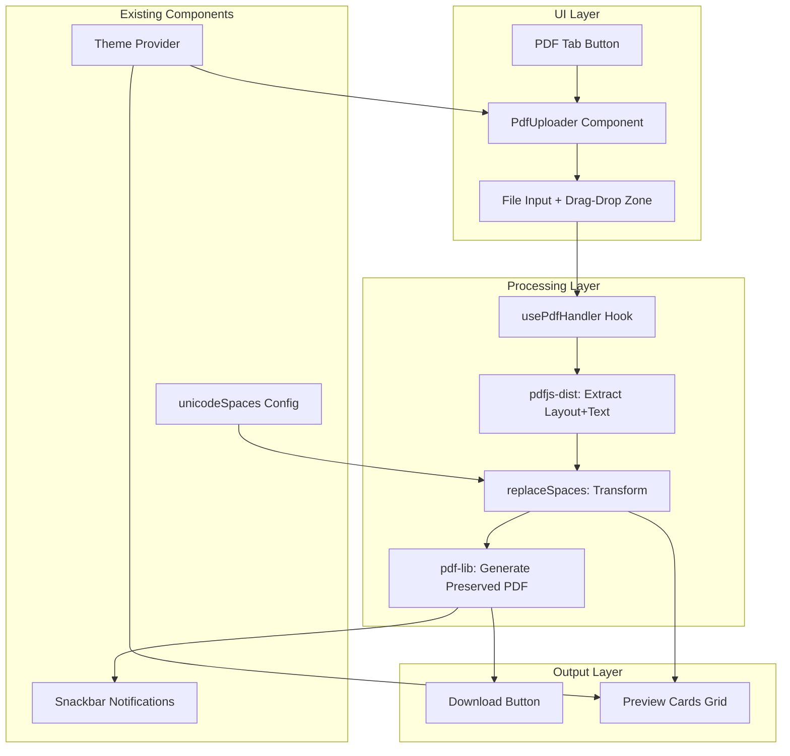
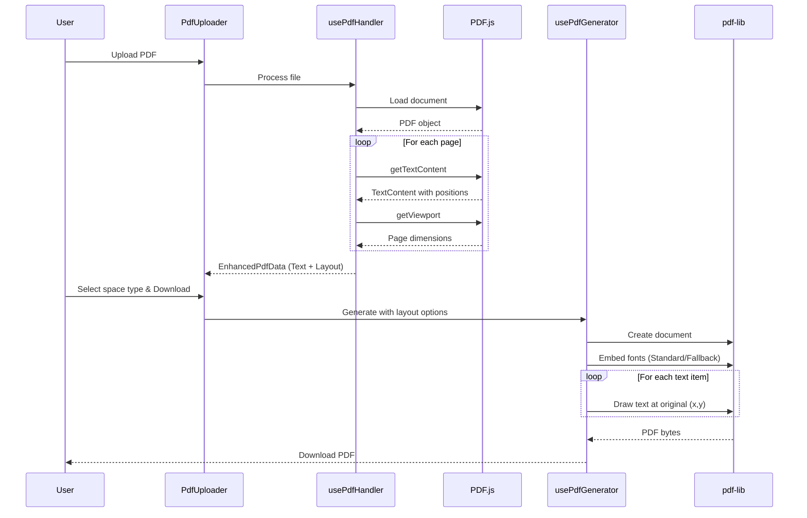
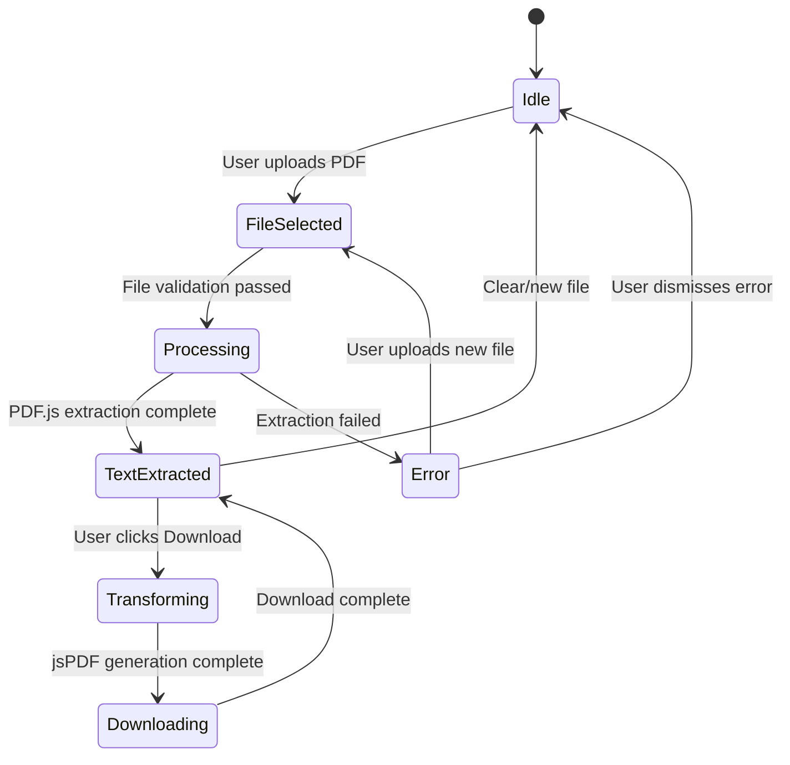
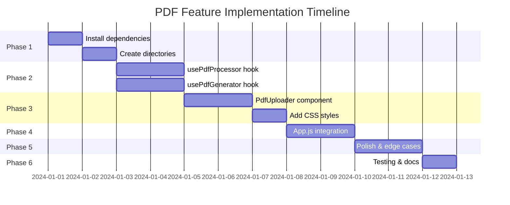

# PDF Feature Architecture Document

## Executive Summary

This document provides a comprehensive architecture and implementation plan for adding PDF support to the Zero-ZeroGPT application. The feature will enable users to upload PDF files, extract text, apply Unicode space transformations using the existing `replaceSpaces` logic, and download a new PDF with the modified text. The implementation uses `pdfjs-dist` for text extraction and `jspdf` for PDF generation, following the existing React + Material UI patterns in the codebase.

---

## Table of Contents

1. [Current Architecture Analysis](#1-current-architecture-analysis)
2. [Library Selection & Justification](#2-library-selection--justification)
3. [Proposed Architecture](#3-proposed-architecture)
4. [Component Design](#4-component-design)
5. [State Management Changes](#5-state-management-changes)
6. [Integration Points](#6-integration-points)
7. [UI/UX Design](#7-uiux-design)
8. [Implementation Plan](#8-implementation-plan)
9. [Potential Challenges & Mitigations](#9-potential-challenges--mitigations)
10. [Testing Strategy](#10-testing-strategy)

---

## 1. Current Architecture Analysis

### 1.1 Application Structure

The application is a single-page React app with the following key characteristics:

```
src/
├── App.js          # Main component (662 lines) - all logic in one file
├── App.css         # Styling (495 lines) - includes Quill editor styles
├── index.js        # React entry point
└── index.css       # Global styles
```

### 1.2 Current State Management

Located in [`src/App.js`](src/App.js:142-150):

```javascript
const [inputText, setInputText] = useState('');           // Plain text input
const [richText, setRichText] = useState('');             // HTML content from ReactQuill
const [inputMode, setInputMode] = useState('rich');       // 'plain' | 'rich'
const [snackbarOpen, setSnackbarOpen] = useState(false);  // Notification visibility
const [snackbarMessage, setSnackbarMessage] = useState('');
const [mode, setMode] = useState(prefersDarkMode ? 'dark' : 'light');  // Theme
const [customSpaces, setCustomSpaces] = useState([]);     // Custom space combinations
const [selectedSpace, setSelectedSpace] = useState('');   // Selected space type
```

### 1.3 Core Transformation Logic

**Primary Function** - [`replaceSpaces()`](src/App.js:254-256):
```javascript
const replaceSpaces = useCallback((text, unicodeCharacter) => {
  return text.split(' ').join(unicodeCharacter);
}, []);
```

**HTML-aware Function** - [`replaceSpacesInHtml()`](src/App.js:258-274):
```javascript
const replaceSpacesInHtml = useCallback((html, unicodeCharacter) => {
  const parser = new DOMParser();
  const doc = parser.parseFromString(html, 'text/html');
  
  const walkTextNodes = (node) => {
    if (node.nodeType === Node.TEXT_NODE) {
      node.textContent = replaceSpaces(node.textContent, unicodeCharacter);
    } else {
      for (let child of node.childNodes) {
        walkTextNodes(child);
      }
    }
  };
  
  walkTextNodes(doc.body);
  return doc.body.innerHTML;
}, [replaceSpaces]);
```

### 1.4 Current Input Modes

The application uses a `ToggleButtonGroup` to switch between:
1. **Plain Text Mode**: Uses MUI `TextField` component
2. **Rich Text Mode**: Uses `ReactQuill` editor

### 1.5 Unicode Space Types

Defined in [`src/App.js`](src/App.js:111-124):
```javascript
const unicodeSpaces = {
  'Em Space': '\u2003',
  'En Space': '\u2002',
  'Thin Space': '\u2009',
  'Thin Space*2': '\u2009\u2009',
  'Hair Space': '\u200A',
  'Narrow, Hair': '\u202F\u200A',
  'Thin, Hair': ' \u2009\u200A',
  'Hair Space*3': '\u200A\u200A\u200A',
  'Narrow No-Break': '\u202F',
  'Narrow No-Break*2': '\u202F\u202F',
  'Zero Width Space': '\u200A\u200B\u200A',
  'Word Joiner': '\u2009\u2060\u2009'
};
```

---

## 2. Library Selection & Justification

### 2.1 PDF Text Extraction: `pdfjs-dist`

**Selected Version**: `^4.0.379` (latest stable)

**Justification**:
| Criteria | pdfjs-dist | pdf-lib | react-pdf |
|----------|-----------|---------|-----------|
| Text Extraction | ✅ Excellent | ❌ Limited | ⚠️ Relies on pdfjs |
| Browser Support | ✅ All modern | ✅ All modern | ✅ All modern |
| Bundle Size | ~2.5MB (with worker) | ~300KB | ~2.5MB (includes pdfjs) |
| Maturity | ✅ Mozilla maintained | ✅ Active | ✅ Active |
| License | Apache 2.0 | MIT | MIT |
| Unicode Support | ✅ Full | ✅ Full | ✅ Full |

**Why `pdfjs-dist`**:
- Mozilla's official PDF.js library, the most battle-tested solution
- Provides accurate text extraction with positioning metadata
- Handles complex PDF structures (multi-column, tables, etc.)
- Active development and security updates
- Already used by Firefox for native PDF viewing

### 2.2 PDF Generation: `pdf-lib` (Replaced `jspdf`)

**Selected Version**: `^1.17.1`

**Justification for Switch**:
While `jspdf` was sufficient for simple text generation, the requirement for **Font Preservation** and **Layout Maintenance** necessitated a library with deeper PDF structure manipulation capabilities.

| Criteria | jspdf | pdf-lib |
|----------|-------|---------|
| **Font Embedding** | Limited (Custom fonts only) | ✅ Excellent (Standard + Custom + Subsetting) |
| **Layout Control** | Basic Flow | ✅ Precise (x, y positioning) |
| **Existing PDF Mod** | ❌ No | ✅ Yes (Merge/Embed pages) |
| **Unicode** | Requires manual font handling | ✅ Native via fontkit |

**Why `pdf-lib`**:
- **Precise Positioning**: Essential for reproducing the exact layout of the source PDF.
- **Font Subsetting**: Allows embedding only used glyphs to keep file size low.
- **Structural Access**: Enables measuring text width/height accurately for layout calculations.

### 2.3 Additional Dependencies

```json
{
  "pdfjs-dist": "^5.4.449",
  "jspdf": "^3.0.4",
  "pdf-lib": "^1.17.1",
  "@pdf-lib/fontkit": "^1.1.1"
}
```

**Optional Enhancement**:
- `file-saver`: For cross-browser file download (jspdf has built-in save, but this provides better compatibility)

---

## 3. Proposed Architecture

### 3.1 High-Level Architecture Diagram



### 3.2 Data Flow Diagram



### 3.3 Component Hierarchy

```
App.js
├── AppBar (existing)
├── ToggleButtonGroup (modified - add PDF option)
├── Conditional Render based on inputMode:
│   ├── 'plain' → TextField (existing)
│   ├── 'rich' → ReactQuill (existing)
│   └── 'pdf' → PdfUploader (NEW)
│       ├── DropZone
│       ├── FileInfo Display
│       ├── ExtractedTextPreview
│       └── ProcessingIndicator
├── OutputCardsGrid (existing - works with all modes)
└── Snackbar (existing)
```

---

## 4. Component Design

### 4.1 New Components

#### 4.1.1 `PdfUploader.js`

**Purpose**: Handle PDF file upload via button click or drag-and-drop

**Props**:
```typescript
interface PdfUploaderProps {
  onTextExtracted: (text: string) => void;
  onFileSelect: (file: File) => void;
  theme: Theme;
}
```

**Implementation Sketch**:
```javascript
// src/components/PdfUploader.js
import React, { useCallback, useState } from 'react';
import { Box, Button, Typography, Paper, CircularProgress } from '@mui/material';
import { CloudUpload as UploadIcon, PictureAsPdf as PdfIcon } from '@mui/icons-material';
import { usePdfProcessor } from '../hooks/usePdfProcessor';

const PdfUploader = ({ onTextExtracted, theme }) => {
  const [isDragging, setIsDragging] = useState(false);
  const { processFile, isProcessing, error, fileName } = usePdfProcessor();

  const handleDrop = useCallback(async (e) => {
    e.preventDefault();
    setIsDragging(false);
    const file = e.dataTransfer.files[0];
    if (file?.type === 'application/pdf') {
      const text = await processFile(file);
      onTextExtracted(text);
    }
  }, [processFile, onTextExtracted]);

  const handleFileSelect = useCallback(async (e) => {
    const file = e.target.files[0];
    if (file) {
      const text = await processFile(file);
      onTextExtracted(text);
    }
  }, [processFile, onTextExtracted]);

  return (
    <Paper
      onDrop={handleDrop}
      onDragOver={(e) => { e.preventDefault(); setIsDragging(true); }}
      onDragLeave={() => setIsDragging(false)}
      sx={{
        p: 4,
        textAlign: 'center',
        border: '2px dashed',
        borderColor: isDragging ? 'primary.main' : 'grey.400',
        backgroundColor: isDragging ? 'action.hover' : 'background.paper',
        cursor: 'pointer',
        transition: 'all 0.3s ease',
      }}
    >
      {isProcessing ? (
        <CircularProgress />
      ) : fileName ? (
        <>
          <PdfIcon sx={{ fontSize: 48, color: 'error.main' }} />
          <Typography>{fileName}</Typography>
        </>
      ) : (
        <>
          <UploadIcon sx={{ fontSize: 48, color: 'primary.main' }} />
          <Typography>Drag & drop a PDF here, or click to select</Typography>
        </>
      )}
      <input
        type="file"
        accept=".pdf,application/pdf"
        onChange={handleFileSelect}
        style={{ display: 'none' }}
        id="pdf-upload-input"
      />
      <label htmlFor="pdf-upload-input">
        <Button component="span" variant="contained" sx={{ mt: 2 }}>
          Select PDF
        </Button>
      </label>
    </Paper>
  );
};

export default PdfUploader;
```

#### 4.1.2 `usePdfHandler.js` (Custom Hook)

**Purpose**: Encapsulate PDF.js text extraction logic with layout preservation

**Implementation Sketch**:
```javascript
// src/hooks/usePdfHandler.js
import { useState, useCallback } from 'react';
import * as pdfjsLib from 'pdfjs-dist';

// Configure worker
pdfjsLib.GlobalWorkerOptions.workerSrc = `//cdnjs.cloudflare.com/ajax/libs/pdf.js/${pdfjsLib.version}/pdf.worker.min.js`;

export const usePdfProcessor = () => {
  const [isProcessing, setIsProcessing] = useState(false);
  const [error, setError] = useState(null);
  const [fileName, setFileName] = useState('');
  const [pageCount, setPageCount] = useState(0);

  const processFile = useCallback(async (file) => {
    setIsProcessing(true);
    setError(null);
    setFileName(file.name);

    try {
      const arrayBuffer = await file.arrayBuffer();
      const pdf = await pdfjsLib.getDocument({ data: arrayBuffer }).promise;
      setPageCount(pdf.numPages);

      let fullText = '';

      for (let i = 1; i <= pdf.numPages; i++) {
        const page = await pdf.getPage(i);
        const textContent = await page.getTextContent();
        const pageText = textContent.items
          .map(item => item.str)
          .join(' ');
        fullText += pageText + '\n\n';
      }

      setIsProcessing(false);
      return fullText.trim();
    } catch (err) {
      setError(err.message);
      setIsProcessing(false);
      throw err;
    }
  }, []);

  return {
    processFile,
    isProcessing,
    error,
    fileName,
    pageCount,
  };
};
```

#### 4.1.3 `usePdfGenerator.js` (Custom Hook)

**Purpose**: Generate and download PDF with transformed text

**Implementation Sketch**:
```javascript
// src/hooks/usePdfGenerator.js
import { useCallback } from 'react';
import { jsPDF } from 'jspdf';

export const usePdfGenerator = () => {
  const generatePdf = useCallback((text, filename = 'transformed.pdf', options = {}) => {
    const {
      fontSize = 12,
      fontFamily = 'helvetica',
      margin = 20,
      pageWidth = 210, // A4 width in mm
      pageHeight = 297, // A4 height in mm
    } = options;

    const doc = new jsPDF({
      orientation: 'portrait',
      unit: 'mm',
      format: 'a4',
    });

    // Calculate available width for text
    const textWidth = pageWidth - (margin * 2);
    
    // Split text into lines that fit the page width
    const lines = doc.splitTextToSize(text, textWidth);
    
    // Calculate line height
    const lineHeight = fontSize * 0.35; // Approximate mm per pt
    const maxLinesPerPage = Math.floor((pageHeight - margin * 2) / lineHeight);
    
    let currentPage = 1;
    let currentLine = 0;

    doc.setFontSize(fontSize);
    doc.setFont(fontFamily);

    while (currentLine < lines.length) {
      if (currentPage > 1) {
        doc.addPage();
      }

      const pageLines = lines.slice(currentLine, currentLine + maxLinesPerPage);
      doc.text(pageLines, margin, margin + lineHeight);
      
      currentLine += maxLinesPerPage;
      currentPage++;
    }

    doc.save(filename);
  }, []);

  return { generatePdf };
};
```

### 4.2 Component File Structure

```
src/
├── components/
│   └── PdfUploader.js       # PDF upload UI component
├── hooks/
│   ├── usePdfProcessor.js   # PDF text extraction hook
│   └── usePdfGenerator.js   # PDF generation hook
├── App.js                   # Modified main component
├── App.css                  # Modified styles (add PDF styles)
└── ...
```

---

## 5. State Management Changes

### 5.1 New State Variables

Add to [`src/App.js`](src/App.js:142-150):

```javascript
// Existing states
const [inputText, setInputText] = useState('');
const [richText, setRichText] = useState('');
const [inputMode, setInputMode] = useState('rich');  // MODIFIED: Now accepts 'plain' | 'rich' | 'pdf'

// NEW states for PDF feature
const [pdfFileName, setPdfFileName] = useState('');      // Original uploaded filename
const [pdfPageCount, setPdfPageCount] = useState(0);     // Number of pages in PDF
const [isPdfProcessing, setIsPdfProcessing] = useState(false); // Loading state
const [pdfError, setPdfError] = useState(null);          // Error message if any
```

### 5.2 State Flow Diagram



### 5.3 Handler Functions

```javascript
// Handle PDF text extraction callback
const handlePdfTextExtracted = useCallback((text, fileName, pageCount) => {
  setInputText(text);
  setPdfFileName(fileName);
  setPdfPageCount(pageCount);
  setIsPdfProcessing(false);
  setPdfError(null);
}, []);

// Handle PDF processing start
const handlePdfProcessingStart = useCallback(() => {
  setIsPdfProcessing(true);
  setPdfError(null);
}, []);

// Handle PDF processing error
const handlePdfError = useCallback((error) => {
  setIsPdfProcessing(false);
  setPdfError(error.message);
  setSnackbarMessage(`PDF Error: ${error.message}`);
  setSnackbarOpen(true);
}, []);

// Handle PDF download
const handleDownloadPdf = useCallback((unicodeCharacter, spaceName) => {
  const transformedText = replaceSpaces(inputText, unicodeCharacter);
  const outputFileName = pdfFileName 
    ? pdfFileName.replace('.pdf', `_${spaceName.replace(/\s+/g, '_')}.pdf`)
    : `transformed_${spaceName.replace(/\s+/g, '_')}.pdf`;
  
  generatePdf(transformedText, outputFileName);
  setSnackbarMessage(`Downloaded PDF with ${spaceName} spacing!`);
  setSnackbarOpen(true);
}, [inputText, pdfFileName, replaceSpaces, generatePdf]);
```

---

## 6. Integration Points

### 6.1 Modifying the Input Mode Toggle

Current implementation in [`src/App.js`](src/App.js:371-386):

```javascript
// BEFORE
<ToggleButtonGroup
  value={inputMode}
  exclusive
  onChange={handleInputModeChange}
  aria-label="input mode"
>
  <ToggleButton value="plain" aria-label="plain text">
    <TextFields sx={{ mr: 1 }} />
    Plain Text
  </ToggleButton>
  <ToggleButton value="rich" aria-label="rich text">
    <FormatColorText sx={{ mr: 1 }} />
    Rich Text
  </ToggleButton>
</ToggleButtonGroup>

// AFTER
<ToggleButtonGroup
  value={inputMode}
  exclusive
  onChange={handleInputModeChange}
  aria-label="input mode"
>
  <ToggleButton value="plain" aria-label="plain text">
    <TextFields sx={{ mr: 1 }} />
    Plain Text
  </ToggleButton>
  <ToggleButton value="rich" aria-label="rich text">
    <FormatColorText sx={{ mr: 1 }} />
    Rich Text
  </ToggleButton>
  <ToggleButton value="pdf" aria-label="pdf upload">
    <PictureAsPdf sx={{ mr: 1 }} />
    PDF
  </ToggleButton>
</ToggleButtonGroup>
```

### 6.2 Conditional Rendering for Input Area

Current implementation in [`src/App.js`](src/App.js:388-452):

```javascript
// BEFORE
{inputMode === 'plain' ? (
  <TextField ... />
) : (
  <ReactQuill ... />
)}

// AFTER
{inputMode === 'plain' ? (
  <TextField ... />
) : inputMode === 'rich' ? (
  <ReactQuill ... />
) : (
  <PdfUploader
    onTextExtracted={handlePdfTextExtracted}
    onProcessingStart={handlePdfProcessingStart}
    onError={handlePdfError}
    isProcessing={isPdfProcessing}
    fileName={pdfFileName}
    theme={theme}
  />
)}
```

### 6.3 Output Cards Modification

The existing output cards at [`src/App.js`](src/App.js:464-546) need to add a download button for PDF mode:

```javascript
// Inside each card, add conditional download button
<Box display="flex" justifyContent="flex-end" mt={1}>
  <Tooltip title={`Copy text with ${key} spacing`}>
    <IconButton
      size="small"
      color="primary"
      onClick={() => handleCopyText(...)}
    >
      <FileCopyIcon fontSize="small" />
    </IconButton>
  </Tooltip>
  
  {/* NEW: PDF Download Button */}
  {inputMode === 'pdf' && inputText && (
    <Tooltip title={`Download PDF with ${key} spacing`}>
      <IconButton
        size="small"
        color="secondary"
        onClick={() => handleDownloadPdf(value, key)}
      >
        <DownloadIcon fontSize="small" />
      </IconButton>
    </Tooltip>
  )}
</Box>
```

### 6.4 Import Statements

Add to top of [`src/App.js`](src/App.js:1-12):

```javascript
// Existing imports
import { PictureAsPdf, Download as DownloadIcon } from '@mui/icons-material';

// New component imports
import PdfUploader from './components/PdfUploader';
import { usePdfGenerator } from './hooks/usePdfGenerator';
```

---

## 7. UI/UX Design

### 7.1 PDF Tab Visual Design

```
┌─────────────────────────────────────────────────────────────────┐
│  [Plain Text]  [Rich Text]  [PDF] ← Selected                    │
├─────────────────────────────────────────────────────────────────┤
│                                                                 │
│     ┌───────────────────────────────────────────────────┐       │
│     │                                                   │       │
│     │         📄                                        │       │
│     │    Drag & drop a PDF here                         │       │
│     │         or                                        │       │
│     │    [   Select PDF File   ]                        │       │
│     │                                                   │       │
│     └───────────────────────────────────────────────────┘       │
│                                                                 │
└─────────────────────────────────────────────────────────────────┘
```

### 7.2 After File Upload

```
┌─────────────────────────────────────────────────────────────────┐
│  [Plain Text]  [Rich Text]  [PDF] ← Selected                    │
├─────────────────────────────────────────────────────────────────┤
│                                                                 │
│     ┌───────────────────────────────────────────────────┐       │
│     │  📕 document.pdf                    [✕ Remove]    │       │
│     │  Pages: 5 | Extracted: 2,340 characters           │       │
│     │─────────────────────────────────────────────────── │       │
│     │  Preview:                                         │       │
│     │  "Lorem ipsum dolor sit amet, consectetur         │       │
│     │   adipiscing elit. Sed do eiusmod tempor..."      │       │
│     │                                                   │       │
│     │  [   Upload Different PDF   ]                     │       │
│     └───────────────────────────────────────────────────┘       │
│                                                                 │
│     [                Clear Text                ]                 │
└─────────────────────────────────────────────────────────────────┘
```

### 7.3 Output Cards with Download

```
┌─────────────────────────────────────────────┐
│  Em Space                     \u2003        │
├─────────────────────────────────────────────┤
│  Lorem▢ipsum▢dolor▢sit▢amet...             │
│                                             │
│  in wide spacing between characters         │
│                                    [📋][⬇️] │ ← Copy + Download
└─────────────────────────────────────────────┘
```

### 7.4 Responsive Behavior

- **Desktop (≥900px)**: 3-column card grid, full dropzone
- **Tablet (600-899px)**: 2-column card grid, full dropzone
- **Mobile (<600px)**: 1-column card grid, compact dropzone with just button

### 7.5 Accessibility

- All buttons have ARIA labels
- Drag-drop zone has keyboard alternative (button)
- Processing state communicated via ARIA live regions
- Color contrast meets WCAG AA standards
- Focus indicators on all interactive elements

---

## 8. Implementation Plan

### Phase 1: Dependencies & Setup (Effort: S, Risk: Low)

| # | Task | File(s) | Est. |
|---|------|---------|------|
| 1.1 | Install pdfjs-dist and jspdf | `package.json` | XS |
| 1.2 | Create `src/components/` directory | - | XS |
| 1.3 | Create `src/hooks/` directory | - | XS |
| 1.4 | Verify installation with `npm start` | - | XS |

### Phase 2: Core Hooks (Effort: M, Risk: Medium)

| # | Task | File(s) | Est. |
|---|------|---------|------|
| 2.1 | Create `usePdfProcessor` hook with text extraction | `src/hooks/usePdfProcessor.js` | M |
| 2.2 | Configure PDF.js worker | `src/hooks/usePdfProcessor.js` | S |
| 2.3 | Create `usePdfGenerator` hook with jsPDF | `src/hooks/usePdfGenerator.js` | M |
| 2.4 | Add Unicode font support to jsPDF | `src/hooks/usePdfGenerator.js` | S |

### Phase 3: UI Components (Effort: M, Risk: Low)

| # | Task | File(s) | Est. |
|---|------|---------|------|
| 3.1 | Create `PdfUploader` component shell | `src/components/PdfUploader.js` | S |
| 3.2 | Implement drag-and-drop functionality | `src/components/PdfUploader.js` | M |
| 3.3 | Implement file input click handler | `src/components/PdfUploader.js` | S |
| 3.4 | Add loading/error states | `src/components/PdfUploader.js` | S |
| 3.5 | Style component for light/dark themes | `src/App.css` | S |

### Phase 4: Integration (Effort: L, Risk: Medium)

| # | Task | File(s) | Est. |
|---|------|---------|------|
| 4.1 | Add new state variables to App.js | `src/App.js` | S |
| 4.2 | Add 'pdf' option to ToggleButtonGroup | `src/App.js` | S |
| 4.3 | Add conditional render for PdfUploader | `src/App.js` | S |
| 4.4 | Import and wire up PDF hooks | `src/App.js` | M |
| 4.5 | Add download buttons to output cards | `src/App.js` | M |
| 4.6 | Add new icon imports | `src/App.js` | XS |

### Phase 5: Polish & Edge Cases (Effort: M, Risk: Low)

| # | Task | File(s) | Est. |
|---|------|---------|------|
| 5.1 | Add file validation (size, type) | `src/components/PdfUploader.js` | S |
| 5.2 | Add character count display | `src/components/PdfUploader.js` | S |
| 5.3 | Add text preview truncation | `src/components/PdfUploader.js` | S |
| 5.4 | Add clear/reset functionality | `src/App.js` | S |
| 5.5 | Add snackbar notifications | `src/App.js` | S |
| 5.6 | Mobile responsiveness testing | `src/App.css` | M |

### Phase 6: Testing & Documentation (Effort: S, Risk: Low)

| # | Task | File(s) | Est. |
|---|------|---------|------|
| 6.1 | Manual test with various PDF types | - | M |
| 6.2 | Test large PDFs (>10MB) | - | S |
| 6.3 | Test Unicode preservation | - | S |
| 6.4 | Update README.md | `README.md` | S |

### Implementation Order (Dependency-aware)



---

## 9. Potential Challenges & Mitigations

### 9.1 PDF.js Worker Configuration

**Challenge**: PDF.js requires a Web Worker for parsing, which can be tricky to configure with Create React App's webpack setup.

**Mitigation**: 
- Use CDN-hosted worker (simplest approach)
- Alternative: Configure webpack in CRA using CRACO or eject

**Code Solution**:
```javascript
import * as pdfjsLib from 'pdfjs-dist';
pdfjsLib.GlobalWorkerOptions.workerSrc = 
  `//cdnjs.cloudflare.com/ajax/libs/pdf.js/${pdfjsLib.version}/pdf.worker.min.js`;
```

### 9.2 Unicode Font Support in jsPDF

**Challenge**: jsPDF's default fonts (Helvetica, Courier, Times) don't support all Unicode characters, including some special spaces.

**Mitigation Options**:
1. **Option A (Recommended)**: Use a Unicode-compatible font like "NotoSans" embedded as base64
2. **Option B**: Accept that some spaces may render differently in output PDF
3. **Option C**: Use pdf-lib instead which has better native Unicode support

**Code Solution** (Option A):
```javascript
// In usePdfGenerator.js
import notoSansBase64 from '../fonts/NotoSans-Regular.ttf'; // base64 encoded

const doc = new jsPDF();
doc.addFileToVFS('NotoSans-Regular.ttf', notoSansBase64);
doc.addFont('NotoSans-Regular.ttf', 'NotoSans', 'normal');
doc.setFont('NotoSans');
```

### 9.3 Large PDF Files

**Challenge**: PDFs with many pages or images can cause memory issues and slow extraction.

**Mitigation**:
- Add file size limit (e.g., 25MB max)
- Show progress indicator during extraction
- Consider extracting text page-by-page with streaming

**Code Solution**:
```javascript
const MAX_FILE_SIZE = 25 * 1024 * 1024; // 25MB

const handleFile = (file) => {
  if (file.size > MAX_FILE_SIZE) {
    setError('File too large. Maximum size is 25MB.');
    return;
  }
  // ... continue processing
};
```

### 9.4 PDF Text Extraction Accuracy

**Challenge**: Some PDFs (scanned documents, image-based) may not have extractable text.

**Mitigation**:
- Detect if extracted text is empty/minimal
- Show warning message suggesting OCR tools
- Provide helpful error messages

**Code Solution**:
```javascript
const text = await extractText(pdf);
if (text.trim().length < 10) {
  setError('No text could be extracted. This may be a scanned or image-based PDF.');
  return;
}
```

### 9.5 Text Layout Preservation

**Challenge**: PDF text extraction loses original layout (columns, tables, etc.)

**Mitigation**:
- Document this limitation clearly in UI
- Extract text in reading order (default PDF.js behavior)
- For v2, consider using text positioning data to preserve layout

---

## 10. Testing Strategy

### 10.1 Manual Test Cases

| ID | Test Case | Expected Result |
|----|-----------|-----------------|
| T1 | Upload valid PDF | Text extracted, displayed in preview |
| T2 | Upload non-PDF file | Error message shown |
| T3 | Upload PDF > 25MB | Size limit error shown |
| T4 | Upload scanned PDF | "No text" warning shown |
| T5 | Drag-drop PDF | Same as T1 |
| T6 | Cancel file dialog | No error, state unchanged |
| T7 | Extract multi-page PDF | All pages concatenated |
| T8 | Download with Em Space | PDF downloads with correct spacing |
| T9 | Download with Hair Space | PDF downloads with correct spacing |
| T10 | Theme switch while PDF loaded | UI maintains state |
| T11 | Switch modes (PDF→Plain→PDF) | State preserved |
| T12 | Mobile touch upload | Works on iOS/Android |

### 10.2 Test PDFs to Prepare

1. Simple single-page text PDF
2. Multi-page PDF (10+ pages)
3. PDF with Unicode characters (Chinese, Arabic, emoji)
4. PDF with tables
5. PDF with columns
6. Scanned/image-based PDF
7. Large PDF (20MB+)
8. Encrypted/password-protected PDF

### 10.3 Browser Compatibility

| Browser | Version | Status |
|---------|---------|--------|
| Chrome | 90+ | Primary target |
| Firefox | 88+ | Supported |
| Safari | 14+ | Supported |
| Edge | 90+ | Supported |
| Mobile Chrome | Latest | Supported |
| Mobile Safari | Latest | Supported |

---

## 11. Evolution: Font Preservation & Layout Maintenance

### 11.1 Feature Overview
The PDF feature has been evolved to support **Font Preservation** and **Page Layout Maintenance**. This enhancement allows the application to generate PDFs that closely mirror the visual structure of the uploaded original, rather than just extracting plain text.

**Key Capabilities:**
- **Layout Preservation**: Extracts and utilizes x, y coordinates, page dimensions, and text transformations to reproduce the original document structure.
- **Font Awareness**: Detects original fonts and maps them to standard PDF fonts or high-quality fallbacks (StandardFonts family) to maintain visual consistency.
- **Hybrid Generation**: Uses `pdf-lib` for high-fidelity generation while retaining `pdfjs-dist` for accurate extraction.

### 11.2 Architecture Extensions
For a detailed deep-dive into the technical implementation of this feature, refer to [`docs/PDF_FONT_LAYOUT_ARCHITECTURE.md`](PDF_FONT_LAYOUT_ARCHITECTURE.md).

**New Utilities:**
- **`src/utils/pdfTypes.js`**: Defines comprehensive data structures for `EnhancedPdfData`, `TextItem`, `PageLayout`, and `FontInfo`.
- **`src/utils/fontManager.js`**: Handles font detection, style mapping, and fallback resolution strategies.
- **`src/utils/colorExtractor.js`**: Extracts text colors using PDF.js `getOperatorList()` for accurate color reproduction.
- **`src/utils/columnDetector.js`**: Analyzes text positions to detect multi-column layouts (2-4 columns) and ensures correct reading order.
- **`src/utils/fontLoader.js`**: Manages lazy loading and caching of custom fonts (specifically Noto Sans) from Google Fonts CDN.

**Architecture Diagram (Enhanced):**

```mermaid
flowchart TB
    subgraph Input
        A[PDF File] --> B[usePdfHandler]
    end
    
    subgraph Extraction Pipeline
        B --> C[PDF.js getDocument]
        C --> D[Extract Text & Layout]
        D --> E[Color Extraction (getOperatorList)]
        D --> F[Column Detection]
        E --> G[EnhancedPdfData]
        F --> G
    end
    
    subgraph Transformation
        G --> H[Space Transformation]
    end
    
    subgraph Generation Pipeline
        H --> I[usePdfGenerator]
        I --> J[Font Loading (fontLoader)]
        J --> K[pdf-lib Generation]
        K --> L[Output PDF]
    end
```

**Bundle Size Impact:**
The addition of `pdf-lib` and `@pdf-lib/fontkit` adds approximately **~250KB** to the bundle size. This is a calculated trade-off for the significant improvement in output quality and feature capability.

---

## Appendix A: Full File Change Summary

### New Files to Create

1. `src/components/PdfUploader.js` - PDF upload component
2. `src/hooks/usePdfProcessor.js` - PDF extraction hook
3. `src/hooks/usePdfGenerator.js` - PDF generation hook
4. `docs/PDF_FEATURE_ARCHITECTURE.md` - This document

### Files to Modify

1. `package.json` - Add pdfjs-dist, jspdf dependencies
2. `src/App.js` - Add state, imports, UI changes
3. `src/App.css` - Add PDF uploader styles

### Dependencies to Add

```json
{
  "pdfjs-dist": "^4.0.379",
  "jspdf": "^2.5.1"
}
```

---

## Appendix B: Key Code Snippets

### B.1 Complete usePdfProcessor.js

```javascript
// src/hooks/usePdfProcessor.js
import { useState, useCallback } from 'react';
import * as pdfjsLib from 'pdfjs-dist';

// Configure PDF.js worker
pdfjsLib.GlobalWorkerOptions.workerSrc = 
  `//cdnjs.cloudflare.com/ajax/libs/pdf.js/${pdfjsLib.version}/pdf.worker.min.js`;

const MAX_FILE_SIZE = 25 * 1024 * 1024; // 25MB

export const usePdfProcessor = () => {
  const [isProcessing, setIsProcessing] = useState(false);
  const [error, setError] = useState(null);
  const [fileName, setFileName] = useState('');
  const [pageCount, setPageCount] = useState(0);
  const [progress, setProgress] = useState(0);

  const validateFile = useCallback((file) => {
    if (!file) {
      throw new Error('No file provided');
    }
    if (file.type !== 'application/pdf' && !file.name.endsWith('.pdf')) {
      throw new Error('Please upload a PDF file');
    }
    if (file.size > MAX_FILE_SIZE) {
      throw new Error('File too large. Maximum size is 25MB.');
    }
    return true;
  }, []);

  const processFile = useCallback(async (file) => {
    setIsProcessing(true);
    setError(null);
    setProgress(0);

    try {
      validateFile(file);
      setFileName(file.name);

      const arrayBuffer = await file.arrayBuffer();
      const pdf = await pdfjsLib.getDocument({ data: arrayBuffer }).promise;
      
      setPageCount(pdf.numPages);
      let fullText = '';

      for (let i = 1; i <= pdf.numPages; i++) {
        const page = await pdf.getPage(i);
        const textContent = await page.getTextContent();
        const pageText = textContent.items
          .filter(item => item.str) // Filter out empty items
          .map(item => item.str)
          .join(' ');
        
        fullText += pageText + '\n\n';
        setProgress(Math.round((i / pdf.numPages) * 100));
      }

      const trimmedText = fullText.trim();
      
      if (trimmedText.length < 10) {
        throw new Error('No text could be extracted. This may be a scanned or image-based PDF.');
      }

      setIsProcessing(false);
      return trimmedText;
    } catch (err) {
      setError(err.message);
      setIsProcessing(false);
      throw err;
    }
  }, [validateFile]);

  const reset = useCallback(() => {
    setIsProcessing(false);
    setError(null);
    setFileName('');
    setPageCount(0);
    setProgress(0);
  }, []);

  return {
    processFile,
    isProcessing,
    error,
    fileName,
    pageCount,
    progress,
    reset,
  };
};
```

### B.2 Complete usePdfGenerator.js

```javascript
// src/hooks/usePdfGenerator.js
import { useCallback } from 'react';
import { jsPDF } from 'jspdf';

export const usePdfGenerator = () => {
  const generatePdf = useCallback((text, filename = 'transformed.pdf', options = {}) => {
    const {
      fontSize = 12,
      margin = 20,
      lineSpacing = 1.5,
    } = options;

    const doc = new jsPDF({
      orientation: 'portrait',
      unit: 'mm',
      format: 'a4',
    });

    const pageWidth = doc.internal.pageSize.getWidth();
    const pageHeight = doc.internal.pageSize.getHeight();
    const textWidth = pageWidth - (margin * 2);
    
    doc.setFontSize(fontSize);
    
    // Split text into lines that fit the page width
    const lines = doc.splitTextToSize(text, textWidth);
    
    // Calculate line height
    const lineHeight = fontSize * 0.352778 * lineSpacing; // pt to mm conversion
    const maxLinesPerPage = Math.floor((pageHeight - margin * 2) / lineHeight);
    
    let y = margin;
    let currentPage = 1;

    for (let i = 0; i < lines.length; i++) {
      if (y + lineHeight > pageHeight - margin) {
        doc.addPage();
        currentPage++;
        y = margin;
      }
      
      doc.text(lines[i], margin, y);
      y += lineHeight;
    }

    // Ensure filename ends with .pdf
    if (!filename.toLowerCase().endsWith('.pdf')) {
      filename += '.pdf';
    }

    doc.save(filename);
    return true;
  }, []);

  return { generatePdf };
};
```

### B.3 App.js State and Handler Additions

```javascript
// Add to imports at top of src/App.js
import { PictureAsPdf, Download as DownloadIcon } from '@mui/icons-material';
import PdfUploader from './components/PdfUploader';
import { usePdfGenerator } from './hooks/usePdfGenerator';

// Add inside App component, after existing state declarations
const [pdfFileName, setPdfFileName] = useState('');
const [pdfPageCount, setPdfPageCount] = useState(0);
const [isPdfProcessing, setIsPdfProcessing] = useState(false);
const [pdfError, setPdfError] = useState(null);

// Initialize PDF generator hook
const { generatePdf } = usePdfGenerator();

// Add handler functions
const handlePdfTextExtracted = useCallback((text, fileName, pageCount) => {
  setInputText(text);
  setPdfFileName(fileName);
  setPdfPageCount(pageCount);
  setIsPdfProcessing(false);
  setPdfError(null);
}, []);

const handlePdfProcessingStart = useCallback(() => {
  setIsPdfProcessing(true);
  setPdfError(null);
}, []);

const handlePdfError = useCallback((error) => {
  setIsPdfProcessing(false);
  setPdfError(error.message || 'An error occurred while processing the PDF');
  setSnackbarMessage(`PDF Error: ${error.message}`);
  setSnackbarOpen(true);
}, []);

const handleDownloadPdf = useCallback((unicodeCharacter, spaceName) => {
  const transformedText = replaceSpaces(inputText, unicodeCharacter);
  const baseName = pdfFileName 
    ? pdfFileName.replace(/\.pdf$/i, '')
    : 'transformed';
  const outputFileName = `${baseName}_${spaceName.replace(/\s+/g, '_')}.pdf`;
  
  try {
    generatePdf(transformedText, outputFileName);
    setSnackbarMessage(`Downloaded PDF with ${spaceName} spacing!`);
    setSnackbarOpen(true);
  } catch (err) {
    setSnackbarMessage(`Error generating PDF: ${err.message}`);
    setSnackbarOpen(true);
  }
}, [inputText, pdfFileName, replaceSpaces, generatePdf]);

// Modify handleClearText to also clear PDF state
const handleClearText = () => {
  setInputText('');
  setRichText('');
  setPdfFileName('');
  setPdfPageCount(0);
  setPdfError(null);
};
```

---

## Appendix C: CSS Additions

```css
/* Add to src/App.css */

/* PDF Uploader Styles */
.pdf-uploader {
  transition: all 0.3s ease;
}

.pdf-uploader-dropzone {
  border: 2px dashed #ccc;
  border-radius: 8px;
  padding: 40px;
  text-align: center;
  cursor: pointer;
  transition: all 0.3s ease;
}

.pdf-uploader-dropzone:hover,
.pdf-uploader-dropzone.dragging {
  border-color: #2196f3;
  background-color: rgba(33, 150, 243, 0.05);
}

.pdf-uploader-dropzone.error {
  border-color: #f44336;
  background-color: rgba(244, 67, 54, 0.05);
}

.pdf-file-info {
  display: flex;
  align-items: center;
  gap: 12px;
  padding: 16px;
  background-color: rgba(0, 0, 0, 0.04);
  border-radius: 8px;
  margin-top: 16px;
}

.pdf-preview {
  max-height: 200px;
  overflow-y: auto;
  padding: 16px;
  background-color: rgba(0, 0, 0, 0.02);
  border-radius: 4px;
  font-family: monospace;
  font-size: 14px;
  white-space: pre-wrap;
  word-break: break-word;
}

/* Dark mode adjustments */
@media (prefers-color-scheme: dark) {
  .pdf-uploader-dropzone {
    border-color: #555;
  }
  
  .pdf-uploader-dropzone:hover,
  .pdf-uploader-dropzone.dragging {
    border-color: #90caf9;
    background-color: rgba(144, 202, 249, 0.08);
  }
  
  .pdf-file-info {
    background-color: rgba(255, 255, 255, 0.05);
  }
  
  .pdf-preview {
    background-color: rgba(255, 255, 255, 0.03);
  }
}

/* Download button animation */
.download-btn {
  transition: transform 0.2s ease;
}

.download-btn:hover {
  transform: scale(1.1);
}

.download-btn:active {
  transform: scale(0.95);
}
```

---

*Document Version: 1.0*
*Created: December 2024*
*Author: Architect Mode*