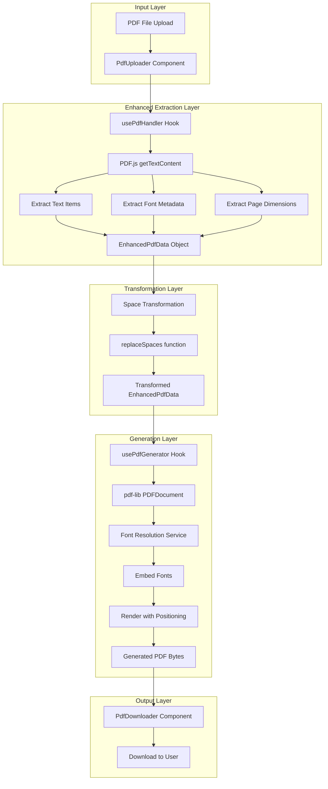
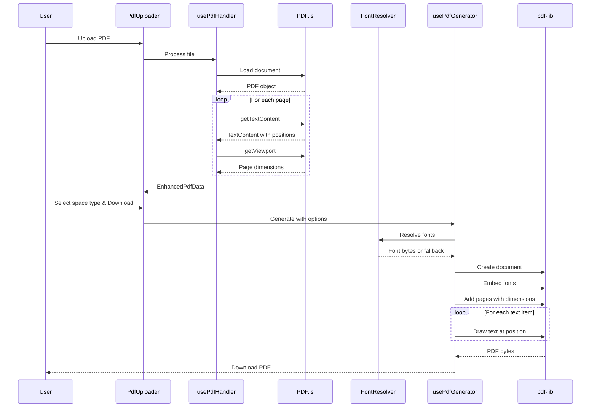
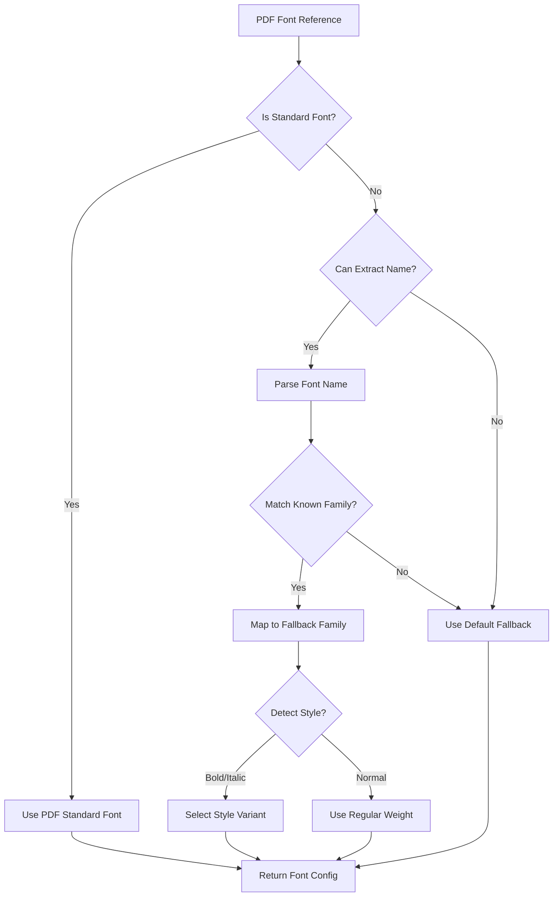
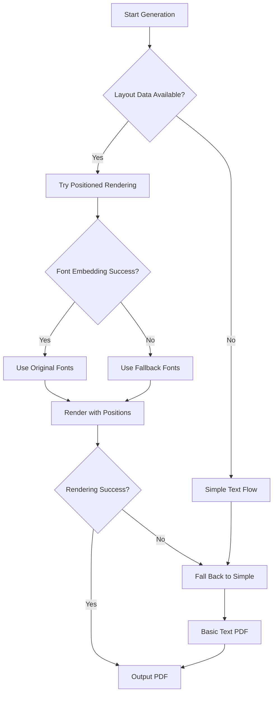

# PDF Font Preservation and Layout Architecture Document

## Executive Summary

This document provides a comprehensive technical architecture for enhancing Zero-ZeroGPT's PDF feature with **Font Preservation** (embed original PDF fonts in generated files) and **Page Layout Maintenance** (maintain original PDF formatting in output). After analyzing the current implementation and researching available libraries, the recommended approach is a **hybrid architecture** that replaces jsPDF with pdf-lib for generation while enhancing the PDF.js extraction to capture font metadata and text positioning data. This enables near-faithful reproduction of original PDF layouts with graceful fallbacks when exact font matching is not possible.

---

## Table of Contents

1. [Current Implementation Analysis](#1-current-implementation-analysis)
2. [Technical Challenges](#2-technical-challenges)
3. [Library Evaluation](#3-library-evaluation)
4. [Proposed Architecture](#4-proposed-architecture)
5. [Data Structures](#5-data-structures)
6. [API and Hook Modifications](#6-api-and-hook-modifications)
7. [Component Updates](#7-component-updates)
8. [Font Handling Strategy](#8-font-handling-strategy)
9. [Layout Preservation Strategy](#9-layout-preservation-strategy)
10. [Fallback Strategies](#10-fallback-strategies)
11. [Implementation Phases](#11-implementation-phases)
12. [Risk Assessment and Mitigation](#12-risk-assessment-and-mitigation)
13. [Dependency Changes](#13-dependency-changes)
14. [Testing Strategy](#14-testing-strategy)

---

## 1. Current Implementation Analysis

### 1.1 Files Analyzed

| File | Purpose | Current State |
|------|---------|---------------|
| [`src/hooks/usePdfHandler.js`](../src/hooks/usePdfHandler.js) | PDF text extraction | Extracts plain text only, discards all formatting |
| [`src/hooks/usePdfGenerator.js`](../src/hooks/usePdfGenerator.js) | PDF generation | Creates new PDFs with default formatting |
| [`src/components/PdfUploader.jsx`](../src/components/PdfUploader.jsx) | Upload UI component | Handles drag-drop and file selection |
| [`src/components/PdfDownloader.jsx`](../src/components/PdfDownloader.jsx) | Download UI component | Triggers PDF download with custom filename |
| [`src/App.js`](../src/App.js) | Main application | Orchestrates PDF workflow |
| [`package.json`](../package.json) | Dependencies | pdfjs-dist ^5.4.449, jspdf ^3.0.4 |
| [`docs/PDF_FEATURE_ARCHITECTURE.md`](./PDF_FEATURE_ARCHITECTURE.md) | Original architecture doc | Basic text extraction/generation design |

### 1.2 Current Text Extraction (usePdfHandler.js)

The current implementation at lines 92-102 extracts only plain text:

```javascript
const textContent = await page.getTextContent();
const pageText = textContent.items
  .filter(item => item.str)
  .map(item => item.str)  // Only extracts text string
  .join(' ')              // Loses all positioning
  .replace(/\s+/g, ' ')   // Normalizes whitespace
  .trim();
```

**What is LOST:**
- Text positioning (x, y coordinates)
- Font information (name, size, style)
- Line structure and paragraph breaks
- Character spacing and word spacing
- Text colors and opacity
- Page dimensions and margins

### 1.3 Current PDF Generation (usePdfGenerator.js)

The current implementation creates new PDFs from scratch with default formatting:

```javascript
const doc = new jsPDF({
  orientation: 'portrait',
  unit: 'mm',
  format: 'a4',  // Fixed format
});
doc.setFontSize(fontSize);  // Fixed font size
const lines = doc.splitTextToSize(text, textWidth);  // Auto line wrap
```

**Limitations:**
- Fixed A4 page format
- Default Helvetica font (limited Unicode)
- No custom font embedding capability used
- Fixed margins and line spacing
- No preservation of original layout

---

## 2. Technical Challenges

### 2.1 Font Preservation Challenges

| Challenge | Severity | Description |
|-----------|----------|-------------|
| Font Subsetting | High | PDFs contain font subsets with only used glyphs |
| Font Name Mapping | High | PDF internal font names don't map to system fonts |
| Font Embedding Rights | Medium | Some fonts prohibit embedding |
| Font File Extraction | High | Extracting embedded fonts requires parsing PDF structure |
| Cross-Platform Fonts | Medium | Font availability varies by OS |

### 2.2 Layout Preservation Challenges

| Challenge | Severity | Description |
|-----------|----------|-------------|
| Transform Matrices | Medium | PDF uses 6-element transformation matrices |
| Coordinate System | Medium | PDF Y-axis is bottom-up (inverted from browser) |
| Multi-Column Layouts | High | Detecting columns requires spatial analysis |
| Text Flow Detection | High | No explicit paragraph markers in PDF |
| Table Detection | High | Tables are just positioned text, not semantic |

### 2.3 PDF.js getTextContent() API Data

The `getTextContent()` method returns items with these properties:

```typescript
interface TextItem {
  str: string;                    // The text string
  dir: string;                    // Text direction ('ltr' or 'rtl')
  transform: [number, number, number, number, number, number];  // 6-element transformation matrix
  width: number;                  // Text width in PDF units
  height: number;                 // Text height (not always reliable)
  fontName: string;               // Internal font reference (e.g., 'g_d0_f1')
  hasEOL: boolean;                // Whether text ends with newline
}
```

**Transform Matrix Interpretation:**
- `[scaleX, skewX, skewY, scaleY, translateX, translateY]`
- `translateX` = X position from left edge
- `translateY` = Y position from bottom edge (PDF coordinate system)
- `scaleX/scaleY` = Font scaling (can derive approximate font size)

---

## 3. Library Evaluation

### 3.1 PDF Generation Libraries Comparison

| Feature | jsPDF (Current) | pdf-lib | pdfmake |
|---------|-----------------|---------|---------|
| Custom Font Embedding | Limited | ✅ Excellent | ✅ Good |
| Precise Text Positioning | Basic | ✅ Full Control | Declarative |
| Unicode Support | ⚠️ Requires custom fonts | ✅ Native with fontkit | ✅ Good |
| Text Measurement | Basic | ✅ Precise | Limited |
| Bundle Size | ~300KB | ~300KB | ~800KB |
| API Complexity | Low | Medium | Medium |
| Modify Existing PDFs | ❌ No | ✅ Yes | ❌ No |
| Font Subsetting | ❌ No | ✅ Yes | ✅ Yes |

### 3.2 Recommendation: Replace jsPDF with pdf-lib

**Rationale:**
1. **Font Embedding**: pdf-lib with @pdf-lib/fontkit provides excellent custom font embedding
2. **Precise Positioning**: Full control over text x, y coordinates
3. **Unicode Support**: Native Unicode support with embedded fonts
4. **Text Measurement**: Can measure text dimensions for layout calculations
5. **Font Subsetting**: Reduces output file size by including only used glyphs
6. **Mature Library**: Well-maintained with 30k+ GitHub stars

### 3.3 PDF.js Enhancement (Keep Current Library)

PDF.js (pdfjs-dist) remains the best choice for extraction because:
1. Most accurate text extraction for complex PDFs
2. Already integrated and working
3. Provides `getTextContent()` with position data (currently unused)
4. Mozilla-maintained with security updates
5. Can access font information via additional APIs

### 3.4 Additional Dependencies Required

| Package | Version | Purpose |
|---------|---------|---------|
| pdf-lib | ^1.17.1 | PDF generation with font embedding |
| @pdf-lib/fontkit | ^1.1.1 | Font parsing and embedding for pdf-lib |

---

## 4. Proposed Architecture

### 4.1 High-Level Architecture Diagram



### 4.2 Data Flow Sequence



---

## 5. Data Structures

### 5.1 Enhanced PDF Data Structure

```typescript
/**
 * Complete extracted PDF data with layout information
 */
interface EnhancedPdfData {
  /** Original filename */
  fileName: string;
  
  /** Total page count */
  pageCount: number;
  
  /** All pages with their content */
  pages: PageData[];
  
  /** Unique fonts used in document */
  fonts: FontInfo[];
  
  /** Document metadata */
  metadata: DocumentMetadata;
}

/**
 * Single page data
 */
interface PageData {
  /** 1-based page number */
  pageNumber: number;
  
  /** Page width in PDF points (1 point = 1/72 inch) */
  width: number;
  
  /** Page height in PDF points */
  height: number;
  
  /** All text items on this page */
  textItems: TextItemData[];
  
  /** Detected text blocks/paragraphs */
  textBlocks: TextBlock[];
}

/**
 * Individual text item with positioning
 */
interface TextItemData {
  /** The text string */
  str: string;
  
  /** X position from left edge (PDF points) */
  x: number;
  
  /** Y position from bottom edge (PDF points) */
  y: number;
  
  /** Text width */
  width: number;
  
  /** Text height (approximate) */
  height: number;
  
  /** Font size derived from transform */
  fontSize: number;
  
  /** Font reference ID */
  fontId: string;
  
  /** Text direction */
  dir: 'ltr' | 'rtl';
  
  /** Full transform matrix */
  transform: number[];
  
  /** Whether this ends a line */
  hasEOL: boolean;
}

/**
 * Grouped text block (paragraph or line group)
 */
interface TextBlock {
  /** Block type */
  type: 'paragraph' | 'heading' | 'line';
  
  /** All text items in this block */
  items: TextItemData[];
  
  /** Bounding box */
  bounds: {
    x: number;
    y: number;
    width: number;
    height: number;
  };
  
  /** Concatenated text */
  text: string;
  
  /** Dominant font in block */
  fontId: string;
  
  /** Average font size */
  fontSize: number;
}

/**
 * Font information extracted from PDF
 */
interface FontInfo {
  /** Internal font ID (e.g., 'g_d0_f1') */
  id: string;
  
  /** Font family name if detectable */
  family: string | null;
  
  /** Detected style */
  style: 'normal' | 'bold' | 'italic' | 'bolditalic';
  
  /** Is this a standard PDF font */
  isStandardFont: boolean;
  
  /** Fallback font to use */
  fallbackFont: string;
  
  /** Embedded font data if extractable (base64) */
  embeddedData: string | null;
}

/**
 * Document metadata
 */
interface DocumentMetadata {
  title: string | null;
  author: string | null;
  subject: string | null;
  creator: string | null;
  creationDate: Date | null;
}
```

### 5.2 Generation Options Structure

```typescript
/**
 * Options for PDF generation
 */
interface PdfGenerationOptions {
  /** Preserve original layout positions */
  preserveLayout: boolean;
  
  /** Preserve original fonts (use fallbacks if unavailable) */
  preserveFonts: boolean;
  
  /** Preserve original page sizes */
  preservePageSize: boolean;
  
  /** Fallback font family when original unavailable */
  fallbackFontFamily: 'helvetica' | 'times' | 'courier' | 'custom';
  
  /** Custom fallback font bytes (if fallbackFontFamily is 'custom') */
  customFallbackFontBytes: Uint8Array | null;
  
  /** Maintain relative positioning even if absolute fails */
  relativePositioning: boolean;
  
  /** Output quality */
  quality: 'draft' | 'standard' | 'high';
}
```

---

## 6. API and Hook Modifications

### 6.1 Enhanced usePdfHandler Hook

**File:** `src/hooks/usePdfHandler.js`

**New Functions to Add:**

```typescript
/**
 * Extract complete PDF data with layout information
 * Replaces simple text-only extraction
 */
const extractEnhancedPdfData = async (file: File): Promise<EnhancedPdfData>;

/**
 * Parse transformation matrix to get position and font size
 */
const parseTransform = (transform: number[]): {
  x: number;
  y: number;
  fontSize: number;
  rotation: number;
};

/**
 * Group text items into logical blocks (paragraphs, lines)
 */
const groupTextIntoBlocks = (items: TextItemData[], pageHeight: number): TextBlock[];

/**
 * Extract font information from PDF
 */
const extractFontInfo = (page: PDFPageProxy): Promise<FontInfo[]>;

/**
 * Invert Y coordinate from PDF space to top-down space
 */
const invertYCoordinate = (y: number, pageHeight: number, itemHeight: number): number;
```

**Modified Return Object:**

```typescript
return {
  // Existing
  pdfFile,
  pdfText,                    // Kept for backward compatibility
  extractedPages,             // Kept for backward compatibility
  isExtracting,
  extractionError,
  pageCount,
  progress,
  extractTextFromPdf,         // Kept for backward compatibility
  clearPdf,
  getTextPreview,
  
  // New
  enhancedPdfData,            // Full layout/font data
  extractEnhancedPdfData,     // New extraction function
  isLayoutPreserved,          // Whether layout data is available
};
```

### 6.2 Enhanced usePdfGenerator Hook

**File:** `src/hooks/usePdfGenerator.js`

**New Functions to Add:**

```typescript
/**
 * Generate PDF with layout preservation
 * Uses pdf-lib instead of jsPDF
 */
const generateLayoutPreservedPdf = async (
  enhancedData: EnhancedPdfData,
  transformedText: string,  // For text replacement
  options: PdfGenerationOptions
): Promise<Uint8Array>;

/**
 * Embed fonts into PDF document
 */
const embedFonts = async (
  pdfDoc: PDFDocument,
  fonts: FontInfo[],
  options: PdfGenerationOptions
): Promise<Map<string, PDFFont>>;

/**
 * Map original font ID to embedded font
 */
const resolveFontMapping = (
  fontId: string,
  fontInfo: FontInfo[],
  embeddedFonts: Map<string, PDFFont>,
  fallbackFont: PDFFont
): PDFFont;

/**
 * Apply space transformation to positioned text items
 */
const transformTextItems = (
  items: TextItemData[],
  unicodeSpace: string
): TextItemData[];

/**
 * Render text items to PDF page with positioning
 */
const renderTextItemsToPage = async (
  page: PDFPage,
  items: TextItemData[],
  fontMap: Map<string, PDFFont>,
  pageHeight: number
): Promise<void>;
```

**Modified Return Object:**

```typescript
return {
  // Existing (kept for backward compatibility)
  isGenerating,
  generationError,
  generatePdf,              // Simple text-based generation
  downloadPdf,
  generateAndDownloadPdf,
  clearError,
  reset,
  
  // New
  generateLayoutPreservedPdf,    // Layout-aware generation
  supportsLayoutPreservation,    // Feature flag
};
```

### 6.3 New Font Resolution Service

**File:** `src/services/fontResolver.js` (NEW)

```typescript
/**
 * Service for resolving and loading fonts
 */

// Standard PDF fonts that can be referenced by name
const STANDARD_PDF_FONTS = {
  'Helvetica': 'Helvetica',
  'Helvetica-Bold': 'Helvetica-Bold',
  'Helvetica-Oblique': 'Helvetica-Oblique',
  'Helvetica-BoldOblique': 'Helvetica-BoldOblique',
  'Times-Roman': 'Times-Roman',
  'Times-Bold': 'Times-Bold',
  'Times-Italic': 'Times-Italic',
  'Times-BoldItalic': 'Times-BoldItalic',
  'Courier': 'Courier',
  'Courier-Bold': 'Courier-Bold',
  'Courier-Oblique': 'Courier-Oblique',
  'Courier-BoldOblique': 'Courier-BoldOblique',
};

// Font family detection patterns
const FONT_FAMILY_PATTERNS = {
  arial: /arial|helvetica/i,
  times: /times|serif/i,
  courier: /courier|mono/i,
  georgia: /georgia/i,
  verdana: /verdana/i,
};

/**
 * Detect font family from font name
 */
export const detectFontFamily = (fontName: string): string | null;

/**
 * Detect font style from font name
 */
export const detectFontStyle = (fontName: string): 'normal' | 'bold' | 'italic' | 'bolditalic';

/**
 * Get fallback font for a given font info
 */
export const getFallbackFont = (fontInfo: FontInfo): string;

/**
 * Load bundled fallback font bytes
 * Uses Noto Sans as universal fallback (supports many Unicode ranges)
 */
export const loadFallbackFontBytes = async (): Promise<Uint8Array>;
```

---

## 7. Component Updates

### 7.1 PdfUploader Component Changes

**File:** `src/components/PdfUploader.jsx`

**Changes Required:**
1. Display layout preservation status
2. Show font detection summary
3. Add option toggles for preservation features

```jsx
// New UI elements to add
<Box sx={{ mt: 2 }}>
  <Typography variant="caption" color="textSecondary">
    Layout Detection: {isLayoutPreserved ? '✓ Available' : '✗ Text Only'}
  </Typography>
  {enhancedPdfData?.fonts?.length > 0 && (
    <Typography variant="caption" color="textSecondary" sx={{ display: 'block' }}>
      Fonts Detected: {enhancedPdfData.fonts.length}
    </Typography>
  )}
</Box>
```

### 7.2 PdfDownloader Component Changes

**File:** `src/components/PdfDownloader.jsx`

**Changes Required:**
1. Add preservation options dialog
2. Show generation mode indicator

```jsx
// New props
interface PdfDownloaderProps {
  // ... existing props
  enhancedPdfData?: EnhancedPdfData;
  preservationOptions?: PdfGenerationOptions;
  onPreservationOptionsChange?: (options: PdfGenerationOptions) => void;
}
```

### 7.3 App.js Integration Changes

**File:** `src/App.js`

**Changes Required:**
1. Store enhanced PDF data in state
2. Add preservation options state
3. Update download handler to use new generation method

```javascript
// New state
const [enhancedPdfData, setEnhancedPdfData] = useState(null);
const [preservationOptions, setPreservationOptions] = useState({
  preserveLayout: true,
  preserveFonts: true,
  preservePageSize: true,
  fallbackFontFamily: 'helvetica',
  customFallbackFontBytes: null,
  relativePositioning: true,
  quality: 'standard'
});

// Updated handler
const handlePdfTextExtracted = useCallback((text, fileName, pages, enhancedData) => {
  setInputText(text);
  setPdfFileName(fileName);
  setEnhancedPdfData(enhancedData);  // New
}, []);
```

---

## 8. Font Handling Strategy

### 8.1 Font Detection Process



### 8.2 Font Fallback Hierarchy

| Original Font Type | Primary Fallback | Secondary Fallback |
|--------------------|------------------|-------------------|
| Sans-serif (Arial, Helvetica) | Helvetica (standard) | Noto Sans |
| Serif (Times, Georgia) | Times-Roman (standard) | Noto Serif |
| Monospace (Courier, Consolas) | Courier (standard) | Noto Sans Mono |
| Custom/Unknown | User preference | Helvetica |

### 8.3 Bundled Fallback Font

**Recommendation:** Bundle **Noto Sans** as universal fallback

**Rationale:**
- Supports 93+ scripts and 2000+ languages
- Open Font License (OFL) - free to embed
- Multiple weights and styles available
- Excellent Unicode coverage for special spaces

**Bundle Size Impact:**
- Noto Sans Regular: ~550KB (full)
- Noto Sans Regular (subset): ~50-100KB (Latin + common Unicode)

**Storage Location:** `src/assets/fonts/NotoSans-Regular.ttf`

---

## 9. Layout Preservation Strategy

### 9.1 Coordinate Transformation

PDF uses a coordinate system where:
- Origin (0,0) is at bottom-left
- Y increases upward
- Units are "points" (1 point = 1/72 inch)

**Transformation Formula:**

```javascript
// PDF coordinates to rendering coordinates
const transformCoordinates = (pdfX, pdfY, pageHeight, itemHeight) => {
  return {
    x: pdfX,
    y: pageHeight - pdfY - itemHeight  // Flip Y axis
  };
};

// Extract position from transform matrix
const extractPosition = (transform) => {
  const [scaleX, skewX, skewY, scaleY, translateX, translateY] = transform;
  return {
    x: translateX,
    y: translateY,
    fontSize: Math.abs(scaleY),  // Approximate font size
    rotation: Math.atan2(skewX, scaleX) * (180 / Math.PI)
  };
};
```

### 9.2 Text Block Grouping Algorithm

```javascript
/**
 * Group text items into logical blocks
 * Uses spatial analysis to detect paragraphs and lines
 */
const groupTextIntoBlocks = (items, pageHeight) => {
  // Sort items by Y position (top to bottom), then X (left to right)
  const sorted = [...items].sort((a, b) => {
    const yDiff = b.y - a.y;  // Higher Y = higher on page
    if (Math.abs(yDiff) < 5) {  // Same line threshold
      return a.x - b.x;  // Sort by X within line
    }
    return yDiff;
  });
  
  const blocks = [];
  let currentBlock = null;
  
  for (const item of sorted) {
    if (!currentBlock) {
      currentBlock = createNewBlock(item);
      continue;
    }
    
    // Check if item belongs to current block
    if (shouldMergeWithBlock(item, currentBlock)) {
      currentBlock.items.push(item);
      updateBlockBounds(currentBlock, item);
    } else {
      blocks.push(finalizeBlock(currentBlock));
      currentBlock = createNewBlock(item);
    }
  }
  
  if (currentBlock) {
    blocks.push(finalizeBlock(currentBlock));
  }
  
  return blocks;
};

const shouldMergeWithBlock = (item, block) => {
  const lastItem = block.items[block.items.length - 1];
  
  // Check vertical gap
  const verticalGap = lastItem.y - (item.y + item.height);
  if (verticalGap > lastItem.height * 1.5) {
    return false;  // Too much vertical gap
  }
  
  // Check if same font/style
  if (item.fontId !== lastItem.fontId) {
    return false;
  }
  
  // Check font size consistency
  if (Math.abs(item.fontSize - lastItem.fontSize) > 2) {
    return false;
  }
  
  return true;
};
```

### 9.3 Page Dimension Preservation

```javascript
// Create page with original dimensions
const createPageWithOriginalSize = (pdfDoc, pageData) => {
  const page = pdfDoc.addPage([pageData.width, pageData.height]);
  return page;
};

// Convert common page sizes to PDF points
const PAGE_SIZES = {
  'a4': [595.28, 841.89],      // 210 x 297 mm
  'letter': [612, 792],         // 8.5 x 11 in
  'legal': [612, 1008],         // 8.5 x 14 in
  'a3': [841.89, 1190.55],     // 297 x 420 mm
};
```

---

## 10. Fallback Strategies

### 10.1 Font Fallback Matrix

| Scenario | Strategy |
|----------|----------|
| Font name detected, standard match | Use PDF standard font |
| Font name detected, no standard match | Use bundled Noto Sans |
| Font name not detected | Use user preference (default: Helvetica) |
| Embedded font extractable | Attempt to embed original |
| Unicode character not supported | Substitute with placeholder (□) |

### 10.2 Layout Fallback Matrix

| Scenario | Strategy |
|----------|----------|
| Position data available | Render at exact coordinates |
| Position data incomplete | Use relative spacing |
| Position data missing | Fall back to simple text flow |
| Page size unknown | Default to A4 |
| Multi-column detected | Preserve column structure |
| Multi-column not detected | Single column flow |

### 10.3 Graceful Degradation Flow



---

## 11. Implementation Phases

### Phase 1: Foundation (Effort: M, Risk: Low)

| # | Task | File(s) | Effort | Risk |
|---|------|---------|--------|------|
| 1.1 | Add pdf-lib and @pdf-lib/fontkit dependencies | package.json | XS | Low |
| 1.2 | Create FontResolver service structure | src/services/fontResolver.js | S | Low |
| 1.3 | Add bundled Noto Sans font file | src/assets/fonts/NotoSans-Regular.ttf | XS | Low |
| 1.4 | Create TypeScript interfaces (as JSDoc) | src/types/pdfTypes.js | S | Low |
| 1.5 | Verify dependencies install correctly | - | XS | Low |

### Phase 2: Enhanced Extraction (Effort: L, Risk: Medium)

| # | Task | File(s) | Effort | Risk |
|---|------|---------|--------|------|
| 2.1 | Add extractEnhancedPdfData function | src/hooks/usePdfHandler.js | M | Medium |
| 2.2 | Implement parseTransform helper | src/hooks/usePdfHandler.js | S | Low |
| 2.3 | Implement groupTextIntoBlocks | src/hooks/usePdfHandler.js | M | Medium |
| 2.4 | Implement extractFontInfo | src/hooks/usePdfHandler.js | M | High |
| 2.5 | Add page dimension extraction | src/hooks/usePdfHandler.js | S | Low |
| 2.6 | Update hook return values | src/hooks/usePdfHandler.js | S | Low |

### Phase 3: Layout-Preserved Generation (Effort: L, Risk: High)

| # | Task | File(s) | Effort | Risk |
|---|------|---------|--------|------|
| 3.1 | Create pdf-lib based generator | src/hooks/usePdfGenerator.js | L | High |
| 3.2 | Implement font embedding with fontkit | src/hooks/usePdfGenerator.js | M | High |
| 3.3 | Implement positioned text rendering | src/hooks/usePdfGenerator.js | M | Medium |
| 3.4 | Add coordinate transformation | src/hooks/usePdfGenerator.js | S | Low |
| 3.5 | Implement page size preservation | src/hooks/usePdfGenerator.js | S | Low |
| 3.6 | Add fallback generation path | src/hooks/usePdfGenerator.js | M | Medium |

### Phase 4: UI Integration (Effort: M, Risk: Low)

| # | Task | File(s) | Effort | Risk |
|---|------|---------|--------|------|
| 4.1 | Update PdfUploader for enhanced data | src/components/PdfUploader.jsx | S | Low |
| 4.2 | Add preservation options UI | src/components/PdfDownloader.jsx | M | Low |
| 4.3 | Integrate enhanced data in App.js | src/App.js | M | Medium |
| 4.4 | Update download handler for layout preservation | src/App.js | S | Low |
| 4.5 | Add loading states for generation | src/App.js | S | Low |

### Phase 5: Testing and Polish (Effort: M, Risk: Low)

| # | Task | File(s) | Effort | Risk |
|---|------|---------|--------|------|
| 5.1 | Test with various PDF types | - | L | Low |
| 5.2 | Test font fallback scenarios | - | M | Low |
| 5.3 | Test layout preservation accuracy | - | M | Low |
| 5.4 | Add error handling for edge cases | All | M | Low |
| 5.5 | Update PDF_FEATURE_ARCHITECTURE.md | docs/PDF_FEATURE_ARCHITECTURE.md | S | Low |
| 5.6 | Update README with new features | README.md | S | Low |

---

## 12. Risk Assessment and Mitigation

### 12.1 Risk Matrix

| Risk | Probability | Impact | Mitigation |
|------|-------------|--------|------------|
| Font extraction fails | High | Medium | Use font name detection + fallback fonts |
| Position data incomplete | Medium | Medium | Implement relative positioning fallback |
| Large PDF performance | Medium | High | Add progress indicators, consider chunking |
| Unicode rendering issues | Low | Medium | Use Noto Sans with wide coverage |
| Bundle size increase | High | Low | Tree-shaking, font subsetting |
| Browser compatibility | Low | High | Test in all major browsers |
| pdf-lib API changes | Low | Medium | Pin version, add integration tests |

### 12.2 Mitigation Strategies

**Font Extraction Failures:**
1. Never crash on font extraction failure
2. Always have a fallback font ready
3. Log warnings for debugging
4. Show user-friendly message about font substitution

**Position Data Issues:**
1. Validate all position data before use
2. Implement bounding box checks
3. Fall back to simple text flow gracefully
4. Maintain backward compatibility with text-only mode

**Performance:**
1. Use Web Workers for heavy extraction
2. Implement progress callbacks
3. Consider extraction caching
4. Allow cancellation of long operations

---

## 13. Dependency Changes

### 13.1 New Dependencies

```json
{
  "dependencies": {
    "pdf-lib": "^1.17.1",
    "@pdf-lib/fontkit": "^1.1.1"
  }
}
```

### 13.2 Updated package.json

```json
{
  "name": "zero-zerogpt",
  "version": "0.3.0",
  "dependencies": {
    "@emotion/react": "^11.11.4",
    "@emotion/styled": "^11.11.5",
    "@mui/icons-material": "^5.15.20",
    "@mui/material": "^5.15.20",
    "@pdf-lib/fontkit": "^1.1.1",
    "jspdf": "^3.0.4",
    "pdf-lib": "^1.17.1",
    "pdfjs-dist": "^5.4.449",
    "react": "^18.3.1",
    "react-dom": "^18.3.1",
    "react-icons": "^5.3.0",
    "react-quill": "^2.0.0",
    "react-scripts": "5.0.1",
    "web-vitals": "^2.1.4"
  }
}
```

**Note:** jsPDF is kept for backward compatibility but pdf-lib will be the primary generator.

### 13.3 Bundle Size Impact

| Package | Size (min+gzip) |
|---------|-----------------|
| pdf-lib | ~147KB |
| @pdf-lib/fontkit | ~62KB |
| Noto Sans Regular (subset) | ~50KB |
| **Total Addition** | **~259KB** |

---

## 14. Testing Strategy

### 14.1 Test Categories

| Category | Description | Priority |
|----------|-------------|----------|
| Unit Tests | Individual function testing | High |
| Integration Tests | Hook and service integration | High |
| Visual Regression | Output PDF comparison | Medium |
| Performance Tests | Large PDF handling | Medium |
| Cross-Browser | Browser compatibility | Medium |

### 14.2 Test PDF Library

Create test PDFs for:
1. Simple single-column text
2. Multi-column layouts
3. Multiple fonts (mixed styles)
4. Unicode characters (CJK, Arabic, emoji)
5. Large documents (50+ pages)
6. Scanned/image PDFs (for error handling)
7. Password-protected PDFs
8. PDFs with embedded fonts

### 14.3 Manual Test Cases

| ID | Test Case | Expected Result |
|----|-----------|-----------------|
| T1 | Upload PDF with standard fonts | Fonts detected, layout preserved |
| T2 | Upload PDF with custom fonts | Fallback fonts used, warning shown |
| T3 | Upload multi-column PDF | Columns preserved in output |
| T4 | Apply space transformation | Text positions maintained |
| T5 | Download with layout preservation | Output matches original layout |
| T6 | Download without layout preservation | Simple text flow output |
| T7 | Large PDF (20+ pages) | Performance acceptable (<30s) |
| T8 | PDF with Unicode text | All characters rendered correctly |

---

## Appendix A: File Changes Summary

### New Files to Create

1. `src/services/fontResolver.js` - Font resolution and fallback logic
2. `src/types/pdfTypes.js` - TypeScript-style JSDoc type definitions
3. `src/assets/fonts/NotoSans-Regular.ttf` - Bundled fallback font
4. `docs/PDF_FONT_LAYOUT_ARCHITECTURE.md` - This document

### Files to Modify

1. `package.json` - Add pdf-lib and fontkit dependencies
2. `src/hooks/usePdfHandler.js` - Enhanced extraction with layout data
3. `src/hooks/usePdfGenerator.js` - Layout-preserved generation with pdf-lib
4. `src/components/PdfUploader.jsx` - Display extraction status
5. `src/components/PdfDownloader.jsx` - Preservation options
6. `src/App.js` - State management for enhanced data

### Files Unchanged

1. `src/index.js` - No changes needed
2. `src/index.css` - No changes needed
3. `src/App.css` - Minor styling additions only

---

## Appendix B: API Reference Summary

### pdf-lib Key APIs Used

```javascript
import { PDFDocument, StandardFonts, rgb } from 'pdf-lib';
import fontkit from '@pdf-lib/fontkit';

// Create document
const pdfDoc = await PDFDocument.create();

// Register fontkit for custom fonts
pdfDoc.registerFontkit(fontkit);

// Embed custom font
const fontBytes = await fetch(fontUrl).then(res => res.arrayBuffer());
const customFont = await pdfDoc.embedFont(fontBytes, { subset: true });

// Create page with custom size
const page = pdfDoc.addPage([width, height]);

// Draw text at position
page.drawText(text, {
  x: xPosition,
  y: yPosition,
  size: fontSize,
  font: customFont,
  color: rgb(0, 0, 0),
});

// Measure text
const textWidth = customFont.widthOfTextAtSize(text, fontSize);
const textHeight = customFont.heightAtSize(fontSize);

// Save document
const pdfBytes = await pdfDoc.save();
```

### PDF.js Enhanced Text Content

```javascript
// Get text content with styles
const textContent = await page.getTextContent({
  includeMarkedContent: true,
  disableCombineTextItems: false,
});

// Each item has:
textContent.items.forEach(item => {
  const { str, transform, width, height, fontName, dir, hasEOL } = item;
  
  // Extract position from transform
  const [scaleX, skewX, skewY, scaleY, translateX, translateY] = transform;
  const x = translateX;
  const y = translateY;
  const fontSize = Math.abs(scaleY);
});
```

---

*Document Version: 1.0*
*Created: December 2024*
*Author: Architect Mode*
*Status: Design Complete - Pending Implementation*