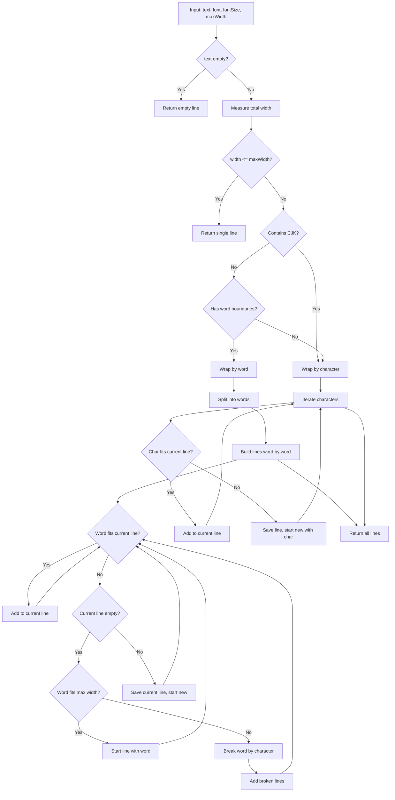

# PDF Text Overflow Solution Architecture

## Executive Summary

This document provides a comprehensive technical design to solve the PDF text overflow problem in Zero-ZeroGPT. When generating PDFs with layout preservation, Unicode text (especially CJK characters, symbols, and special characters) can extend beyond the visible page area because the current implementation places text at exact coordinates without measuring text width or respecting page boundaries. The solution introduces text width measurement, intelligent line breaking, and margin-aware text rendering.

---

## Table of Contents

1. [Problem Analysis](#1-problem-analysis)
2. [Proposed Solution Architecture](#2-proposed-solution-architecture)
3. [Detailed Implementation Steps](#3-detailed-implementation-steps)
4. [Code Changes Required](#4-code-changes-required)
5. [Edge Cases and Error Handling](#5-edge-cases-and-error-handling)
6. [Testing Recommendations](#6-testing-recommendations)
7. [Appendix: Algorithm Details](#7-appendix-algorithm-details)

---

## 1. Problem Analysis

### 1.1 Current Behavior

The current PDF generation flow in [`usePdfGenerator.js`](../src/hooks/usePdfGenerator.js) works as follows:

1. **Text Extraction**: Source PDF text items are extracted with their original positions (x, y coordinates)
2. **Text Transformation**: Spaces are replaced/modified per the transformation rules
3. **Direct Rendering**: Text is placed at the exact original coordinates without width checking

```javascript
// Current code at usePdfGenerator.js:575-586
page.drawText(textToRender, {
  x: x,      // Original X position - NO BOUNDS CHECK
  y: y,
  size: fontSize,
  font: font,
  color: rgb(color.r, color.g, color.b),
});
```

### 1.2 Root Cause

| Issue | Description | Impact |
|-------|-------------|--------|
| **No Width Measurement** | Text is rendered without measuring how wide it will be | Text extends past page edge |
| **Character Width Variation** | Unicode characters (CJK, Arabic, etc.) are often 2x wider than Latin | Same text length, much wider rendering |
| **No Right Margin Awareness** | Code doesn't know where the page edge is relative to text position | Overflow is invisible |
| **No Text Wrapping** | Long text items are never broken into multiple lines | Single line extends indefinitely |

### 1.3 Failure Scenarios


### 1.4 Affected Code Paths

| File | Function | Line | Issue |
|------|----------|------|-------|
| [`usePdfGenerator.js`](../src/hooks/usePdfGenerator.js:575) | `generatePdfWithLayout` | 575-586 | No width check before `drawText` |
| [`usePdfGenerator.js`](../src/hooks/usePdfGenerator.js:614-615) | Fallback rendering | 614-615 | Simple line rendering, no wrap |
| [`fontLoader.js`](../src/utils/fontLoader.js) | All functions | - | No text width measurement API |

---

## 2. Proposed Solution Architecture

### 2.1 Solution Overview

Implement a **Text Layout Engine** that measures text width and applies intelligent rendering strategies:


### 2.2 Key Components

| Component | Purpose | Location |
|-----------|---------|----------|
| `textLayoutEngine.js` | **NEW** - Core text measurement and wrapping | `src/utils/textLayoutEngine.js` |
| `usePdfGenerator.js` | Modified to use layout engine | `src/hooks/usePdfGenerator.js` |
| `pdfTypes.js` | New type definitions for layout | `src/utils/pdfTypes.js` |

### 2.3 Design Principles

1. **Measure First, Render Second**: Always calculate text width before drawing
2. **Respect Page Boundaries**: Use configurable margins (default: match source document)
3. **Preserve Layout Intent**: Keep text as close to original position as possible
4. **Graceful Degradation**: If precise layout fails, fall back to readable output
5. **Unicode-Aware**: Handle variable-width characters correctly

### 2.4 Overflow Handling Strategies

| Strategy | Use Case | Behavior |
|----------|----------|----------|
| **Wrap** (Default) | Long text items | Break into multiple lines at word/character boundaries |
| **Scale** | Short items that slightly overflow | Reduce font size to fit |
| **Truncate** | When space is very limited | Cut text and add ellipsis |
| **Reflow** | Complex layouts | Re-layout the entire line group |

---

## 3. Detailed Implementation Steps

### 3.1 Step 1: Create Text Layout Engine Module

**File:** `src/utils/textLayoutEngine.js` (NEW)

```javascript
/**
 * Text Layout Engine
 * 
 * Provides text measurement, wrapping, and overflow handling for PDF generation.
 * Works with pdf-lib fonts to accurately measure text width.
 * 
 * @module textLayoutEngine
 */

/**
 * @typedef {Object} TextMeasurement
 * @property {number} width - Total text width in PDF points
 * @property {number} height - Text height in PDF points
 * @property {number} charCount - Number of characters
 * @property {number[]} charWidths - Width of each character
 */

/**
 * @typedef {Object} LayoutConstraints
 * @property {number} maxWidth - Maximum allowed width
 * @property {number} leftMargin - Left margin position
 * @property {number} rightMargin - Right margin position
 * @property {number} pageWidth - Total page width
 */

/**
 * @typedef {Object} WrappedLine
 * @property {string} text - Text content for this line
 * @property {number} width - Width of this line
 * @property {number} startCharIndex - Start index in original text
 * @property {number} endCharIndex - End index in original text
 */

/**
 * @typedef {Object} TextLayoutResult
 * @property {'normal'|'wrapped'|'scaled'|'truncated'} strategy - Strategy used
 * @property {WrappedLine[]} lines - Lines to render
 * @property {number} fontSize - Final font size (may be scaled)
 * @property {number} totalHeight - Total height of all lines
 * @property {boolean} overflow - True if text was modified to fit
 */
```

### 3.2 Step 2: Implement Core Measurement Functions

**Key Functions in `textLayoutEngine.js`:**

```javascript
/**
 * Measure the width of text using a pdf-lib font
 * 
 * @param {string} text - Text to measure
 * @param {PDFFont} font - pdf-lib embedded font object
 * @param {number} fontSize - Font size in points
 * @returns {TextMeasurement} Measurement result
 */
export function measureText(text, font, fontSize) {
  // pdf-lib fonts provide widthOfTextAtSize method
  const width = font.widthOfTextAtSize(text, fontSize);
  const height = font.heightAtSize(fontSize);
  
  // Measure individual characters for precise wrapping
  const charWidths = [];
  for (const char of text) {
    try {
      charWidths.push(font.widthOfTextAtSize(char, fontSize));
    } catch (err) {
      // Character not in font - estimate width
      charWidths.push(fontSize * 0.6);
    }
  }
  
  return {
    width,
    height,
    charCount: text.length,
    charWidths
  };
}

/**
 * Calculate available width for text at a given position
 * 
 * @param {number} x - Text X position
 * @param {LayoutConstraints} constraints - Page constraints
 * @returns {number} Available width in points
 */
export function calculateAvailableWidth(x, constraints) {
  const rightBoundary = constraints.pageWidth - constraints.rightMargin;
  return Math.max(0, rightBoundary - x);
}

/**
 * Check if text fits within available space
 * 
 * @param {string} text - Text to check
 * @param {PDFFont} font - Font to use
 * @param {number} fontSize - Font size
 * @param {number} availableWidth - Available width
 * @returns {boolean} True if text fits
 */
export function textFits(text, font, fontSize, availableWidth) {
  const measurement = measureText(text, font, fontSize);
  return measurement.width <= availableWidth;
}
```

### 3.3 Step 3: Implement Text Wrapping

```javascript
/**
 * Break text into multiple lines that fit within width constraint
 * 
 * Algorithm:
 * 1. Try to break at word boundaries first (spaces)
 * 2. If a single word is too long, break at character level
 * 3. Handle CJK text which has no word boundaries
 * 
 * @param {string} text - Text to wrap
 * @param {PDFFont} font - Font for measurement
 * @param {number} fontSize - Font size
 * @param {number} maxWidth - Maximum line width
 * @returns {WrappedLine[]} Array of lines
 */
export function wrapText(text, font, fontSize, maxWidth) {
  if (!text || maxWidth <= 0) {
    return [{ text: '', width: 0, startCharIndex: 0, endCharIndex: 0 }];
  }
  
  const lines = [];
  const measurement = measureText(text, font, fontSize);
  
  // If it fits, return as single line
  if (measurement.width <= maxWidth) {
    return [{
      text,
      width: measurement.width,
      startCharIndex: 0,
      endCharIndex: text.length
    }];
  }
  
  // Need to wrap - analyze text type
  const hasWordBoundaries = /\s/.test(text);
  const isCJK = containsCJK(text);
  
  if (hasWordBoundaries && !isCJK) {
    // Word-based wrapping for Latin text
    return wrapByWords(text, font, fontSize, maxWidth);
  } else {
    // Character-based wrapping for CJK or no-space text
    return wrapByCharacters(text, font, fontSize, maxWidth, measurement.charWidths);
  }
}

/**
 * Wrap text by word boundaries
 */
function wrapByWords(text, font, fontSize, maxWidth) {
  const words = text.split(/(\s+)/); // Keep spaces as separate tokens
  const lines = [];
  let currentLine = '';
  let currentWidth = 0;
  let startIndex = 0;
  let charIndex = 0;
  
  for (const word of words) {
    const wordWidth = font.widthOfTextAtSize(word, fontSize);
    
    if (currentWidth + wordWidth <= maxWidth) {
      currentLine += word;
      currentWidth += wordWidth;
    } else {
      // Word doesn't fit
      if (currentLine.length > 0) {
        // Save current line
        lines.push({
          text: currentLine,
          width: currentWidth,
          startCharIndex: startIndex,
          endCharIndex: charIndex
        });
        startIndex = charIndex;
      }
      
      // Check if single word fits
      if (wordWidth <= maxWidth) {
        currentLine = word;
        currentWidth = wordWidth;
      } else {
        // Word too long - break it
        const brokenLines = wrapByCharacters(word, font, fontSize, maxWidth, null);
        for (let i = 0; i < brokenLines.length - 1; i++) {
          lines.push({
            ...brokenLines[i],
            startCharIndex: startIndex + brokenLines[i].startCharIndex,
            endCharIndex: startIndex + brokenLines[i].endCharIndex
          });
        }
        const lastBroken = brokenLines[brokenLines.length - 1];
        currentLine = lastBroken.text;
        currentWidth = lastBroken.width;
      }
    }
    charIndex += word.length;
  }
  
  // Add final line
  if (currentLine.length > 0) {
    lines.push({
      text: currentLine,
      width: currentWidth,
      startCharIndex: startIndex,
      endCharIndex: charIndex
    });
  }
  
  return lines;
}

/**
 * Wrap text by individual characters (for CJK or long words)
 */
function wrapByCharacters(text, font, fontSize, maxWidth, precomputedWidths) {
  const lines = [];
  let currentLine = '';
  let currentWidth = 0;
  let startIndex = 0;
  
  const chars = [...text]; // Properly handle Unicode
  
  for (let i = 0; i < chars.length; i++) {
    const char = chars[i];
    const charWidth = precomputedWidths 
      ? precomputedWidths[i] 
      : font.widthOfTextAtSize(char, fontSize);
    
    if (currentWidth + charWidth <= maxWidth) {
      currentLine += char;
      currentWidth += charWidth;
    } else {
      // Character doesn't fit
      if (currentLine.length > 0) {
        lines.push({
          text: currentLine,
          width: currentWidth,
          startCharIndex: startIndex,
          endCharIndex: startIndex + currentLine.length
        });
        startIndex = startIndex + currentLine.length;
      }
      currentLine = char;
      currentWidth = charWidth;
    }
  }
  
  // Add final line
  if (currentLine.length > 0) {
    lines.push({
      text: currentLine,
      width: currentWidth,
      startCharIndex: startIndex,
      endCharIndex: startIndex + currentLine.length
    });
  }
  
  return lines;
}

/**
 * Check if text contains CJK characters
 */
function containsCJK(text) {
  // CJK Unicode ranges
  const cjkRegex = /[\u4E00-\u9FFF\u3400-\u4DBF\u3040-\u309F\u30A0-\u30FF\uAC00-\uD7AF]/;
  return cjkRegex.test(text);
}
```

### 3.4 Step 4: Implement Font Scaling Strategy

```javascript
/**
 * Calculate scaled font size to fit text within width
 * 
 * @param {string} text - Text to fit
 * @param {PDFFont} font - Font for measurement
 * @param {number} originalFontSize - Original font size
 * @param {number} targetWidth - Target width to fit within
 * @param {number} [minFontSize=6] - Minimum allowed font size
 * @returns {{fontSize: number, fits: boolean}} Scaled size or original if can't fit
 */
export function calculateScaledFontSize(text, font, originalFontSize, targetWidth, minFontSize = 6) {
  const originalWidth = font.widthOfTextAtSize(text, originalFontSize);
  
  if (originalWidth <= targetWidth) {
    return { fontSize: originalFontSize, fits: true };
  }
  
  // Calculate required scaling factor
  const scaleFactor = targetWidth / originalWidth;
  const scaledSize = Math.floor(originalFontSize * scaleFactor);
  
  if (scaledSize >= minFontSize) {
    return { fontSize: scaledSize, fits: true };
  }
  
  // Can't scale small enough - return minimum
  return { fontSize: minFontSize, fits: false };
}
```

### 3.5 Step 5: Implement Main Layout Function

```javascript
/**
 * Layout text with overflow handling
 * 
 * Main entry point for the layout engine. Determines the best strategy
 * to render text within constraints.
 * 
 * @param {string} text - Text to layout
 * @param {PDFFont} font - pdf-lib font object
 * @param {number} fontSize - Original font size
 * @param {number} x - Text X position
 * @param {LayoutConstraints} constraints - Page constraints
 * @param {Object} [options] - Layout options
 * @param {string} [options.overflowStrategy='wrap'] - 'wrap'|'scale'|'truncate'
 * @param {number} [options.lineHeight=1.2] - Line height multiplier
 * @param {number} [options.minFontSize=6] - Minimum font size for scaling
 * @returns {TextLayoutResult} Layout result with rendering instructions
 */
export function layoutText(text, font, fontSize, x, constraints, options = {}) {
  const {
    overflowStrategy = 'wrap',
    lineHeight = 1.2,
    minFontSize = 6
  } = options;
  
  // Calculate available width
  const availableWidth = calculateAvailableWidth(x, constraints);
  
  // Measure text
  const measurement = measureText(text, font, fontSize);
  
  // Check if it fits
  if (measurement.width <= availableWidth) {
    return {
      strategy: 'normal',
      lines: [{
        text,
        width: measurement.width,
        startCharIndex: 0,
        endCharIndex: text.length
      }],
      fontSize,
      totalHeight: measurement.height,
      overflow: false
    };
  }
  
  // Text overflows - apply strategy
  switch (overflowStrategy) {
    case 'scale': {
      const scaled = calculateScaledFontSize(text, font, fontSize, availableWidth, minFontSize);
      if (scaled.fits) {
        const scaledMeasurement = measureText(text, font, scaled.fontSize);
        return {
          strategy: 'scaled',
          lines: [{
            text,
            width: scaledMeasurement.width,
            startCharIndex: 0,
            endCharIndex: text.length
          }],
          fontSize: scaled.fontSize,
          totalHeight: scaledMeasurement.height,
          overflow: true
        };
      }
      // Fall through to wrap if scaling doesn't work
    }
    
    case 'wrap':
    default: {
      const wrappedLines = wrapText(text, font, fontSize, availableWidth);
      const lineHeightPx = font.heightAtSize(fontSize) * lineHeight;
      return {
        strategy: 'wrapped',
        lines: wrappedLines,
        fontSize,
        totalHeight: wrappedLines.length * lineHeightPx,
        overflow: true
      };
    }
    
    case 'truncate': {
      const truncated = truncateToFit(text, font, fontSize, availableWidth);
      return {
        strategy: 'truncated',
        lines: [{
          text: truncated.text,
          width: truncated.width,
          startCharIndex: 0,
          endCharIndex: truncated.endIndex
        }],
        fontSize,
        totalHeight: measurement.height,
        overflow: true
      };
    }
  }
}

/**
 * Truncate text to fit with ellipsis
 */
function truncateToFit(text, font, fontSize, maxWidth) {
  const ellipsis = '…';
  const ellipsisWidth = font.widthOfTextAtSize(ellipsis, fontSize);
  const targetWidth = maxWidth - ellipsisWidth;
  
  if (targetWidth <= 0) {
    return { text: ellipsis, width: ellipsisWidth, endIndex: 0 };
  }
  
  const chars = [...text];
  let currentWidth = 0;
  let truncatedText = '';
  
  for (let i = 0; i < chars.length; i++) {
    const charWidth = font.widthOfTextAtSize(chars[i], fontSize);
    if (currentWidth + charWidth > targetWidth) {
      return {
        text: truncatedText + ellipsis,
        width: currentWidth + ellipsisWidth,
        endIndex: i
      };
    }
    truncatedText += chars[i];
    currentWidth += charWidth;
  }
  
  return { text, width: currentWidth, endIndex: text.length };
}
```

### 3.6 Step 6: Add Type Definitions

**Add to `src/utils/pdfTypes.js`:**

```javascript
// ============================================================================
// Text Layout Types (for Text Overflow Solution)
// ============================================================================

/**
 * @typedef {Object} TextMeasurement
 * @description Result of measuring text dimensions
 * @property {number} width - Total text width in PDF points
 * @property {number} height - Text height in PDF points
 * @property {number} charCount - Number of characters
 * @property {number[]} charWidths - Width of each character
 */

/**
 * Creates a default TextMeasurement
 * @returns {TextMeasurement}
 */
export function createTextMeasurement() {
  return {
    width: 0,
    height: 0,
    charCount: 0,
    charWidths: []
  };
}

/**
 * @typedef {Object} LayoutConstraints
 * @description Page constraints for text layout
 * @property {number} maxWidth - Maximum allowed width
 * @property {number} leftMargin - Left margin position
 * @property {number} rightMargin - Right margin position (distance from right edge)
 * @property {number} pageWidth - Total page width
 * @property {number} pageHeight - Total page height
 */

/**
 * Creates LayoutConstraints from a PageLayout
 * @param {PageLayout} pageLayout - Page layout information
 * @returns {LayoutConstraints}
 */
export function createLayoutConstraints(pageLayout) {
  return {
    maxWidth: pageLayout.width - pageLayout.margins.left - pageLayout.margins.right,
    leftMargin: pageLayout.margins.left,
    rightMargin: pageLayout.margins.right,
    pageWidth: pageLayout.width,
    pageHeight: pageLayout.height
  };
}

/**
 * @typedef {Object} WrappedLine
 * @description A single line of wrapped text
 * @property {string} text - Text content for this line
 * @property {number} width - Width of this line in points
 * @property {number} startCharIndex - Start index in original text
 * @property {number} endCharIndex - End index in original text (exclusive)
 */

/**
 * @typedef {Object} TextLayoutResult
 * @description Result of text layout with overflow handling
 * @property {'normal'|'wrapped'|'scaled'|'truncated'} strategy - Strategy used
 * @property {WrappedLine[]} lines - Lines to render
 * @property {number} fontSize - Final font size (may be scaled)
 * @property {number} totalHeight - Total height of all lines
 * @property {boolean} overflow - True if text was modified to fit
 */

/**
 * @typedef {Object} TextLayoutOptions
 * @description Options for text layout
 * @property {'wrap'|'scale'|'truncate'} [overflowStrategy='wrap'] - How to handle overflow
 * @property {number} [lineHeight=1.2] - Line height multiplier
 * @property {number} [minFontSize=6] - Minimum font size for scaling
 * @property {boolean} [preserveWhitespace=false] - Preserve leading/trailing whitespace
 */

/**
 * Creates default TextLayoutOptions
 * @returns {TextLayoutOptions}
 */
export function createTextLayoutOptions() {
  return {
    overflowStrategy: 'wrap',
    lineHeight: 1.2,
    minFontSize: 6,
    preserveWhitespace: false
  };
}
```

---

## 4. Code Changes Required

### 4.1 New File: `src/utils/textLayoutEngine.js`

**Purpose:** Core text measurement and layout engine

**Exports:**
- `measureText(text, font, fontSize)` → `TextMeasurement`
- `calculateAvailableWidth(x, constraints)` → `number`
- `textFits(text, font, fontSize, availableWidth)` → `boolean`
- `wrapText(text, font, fontSize, maxWidth)` → `WrappedLine[]`
- `calculateScaledFontSize(text, font, fontSize, targetWidth, minFontSize)` → `{fontSize, fits}`
- `layoutText(text, font, fontSize, x, constraints, options)` → `TextLayoutResult`
- `containsCJK(text)` → `boolean`

**Estimated Size:** ~250 lines

### 4.2 Modify: `src/hooks/usePdfGenerator.js`

**Changes Required:**

#### 4.2.1 Add Import (after line 6)
```javascript
import { 
  layoutText, 
  createLayoutConstraints 
} from '../utils/textLayoutEngine';
```

#### 4.2.2 Update `generatePdfWithLayout` Function (lines 439-683)

**Before (lines 566-586):**
```javascript
// Only draw if there's text to render
if (textToRender.length > 0) {
  page.drawText(textToRender, {
    x: x,
    y: y,
    size: fontSize,
    font: font,
    color: rgb(
      Math.max(0, Math.min(1, color.r || 0)),
      Math.max(0, Math.min(1, color.g || 0)),
      Math.max(0, Math.min(1, color.b || 0))
    ),
  });
}
```

**After:**
```javascript
// Only draw if there's text to render
if (textToRender.length > 0) {
  // Create layout constraints from page layout
  const constraints = {
    maxWidth: pageLayout.width - (pageLayout.margins?.left || 72) - (pageLayout.margins?.right || 72),
    leftMargin: pageLayout.margins?.left || 72,
    rightMargin: pageLayout.margins?.right || 72,
    pageWidth: pageLayout.width,
    pageHeight: pageLayout.height
  };
  
  // Layout text with overflow handling
  const layoutResult = layoutText(
    textToRender,
    font,
    fontSize,
    x,
    constraints,
    { overflowStrategy: 'wrap', lineHeight: 1.2 }
  );
  
  // Render each line
  const lineHeightPx = font.heightAtSize(layoutResult.fontSize) * 1.2;
  let currentY = y;
  
  for (let lineIndex = 0; lineIndex < layoutResult.lines.length; lineIndex++) {
    const line = layoutResult.lines[lineIndex];
    
    // Check if we need a new page for wrapped lines
    if (lineIndex > 0 && currentY - lineHeightPx < (pageLayout.margins?.bottom || 72)) {
      // TODO: Handle page break for very long wrapped text
      console.warn('Wrapped text extends beyond page bottom margin');
      break;
    }
    
    page.drawText(line.text, {
      x: x,
      y: currentY,
      size: layoutResult.fontSize,
      font: font,
      color: rgb(
        Math.max(0, Math.min(1, color.r || 0)),
        Math.max(0, Math.min(1, color.g || 0)),
        Math.max(0, Math.min(1, color.b || 0))
      ),
    });
    
    // Move down for next line (PDF Y is bottom-up)
    currentY -= lineHeightPx;
  }
  
  // Log overflow warning for debugging
  if (layoutResult.overflow) {
    console.log(`Text overflow handled with strategy: ${layoutResult.strategy}`, {
      originalText: textToRender.substring(0, 50),
      lines: layoutResult.lines.length,
      fontSize: layoutResult.fontSize
    });
  }
}
```

#### 4.2.3 Update Fallback Rendering (lines 600-627)

Apply similar layout logic to the fallback path for non-layout-preserved rendering.

### 4.3 Modify: `src/utils/pdfTypes.js`

**Add at end of file (after line 544):**
- `TextMeasurement` type definition
- `LayoutConstraints` type definition
- `WrappedLine` type definition
- `TextLayoutResult` type definition
- `TextLayoutOptions` type definition
- Factory functions for each type

**Estimated additions:** ~60 lines

### 4.4 Summary of File Changes

| File | Action | Changes | Effort |
|------|--------|---------|--------|
| `src/utils/textLayoutEngine.js` | **CREATE** | New 250-line module | M |
| `src/hooks/usePdfGenerator.js` | **MODIFY** | Add layout engine integration | M |
| `src/utils/pdfTypes.js` | **MODIFY** | Add 5 new type definitions | S |

---

## 5. Edge Cases and Error Handling

### 5.1 Edge Cases

| Edge Case | Handling Strategy |
|-----------|-------------------|
| **Empty text** | Return immediately with empty layout result |
| **Very narrow available width** | Minimum width check (e.g., 10pt), truncate if too narrow |
| **Single character wider than available** | Force render with minimum scaling |
| **Font missing character** | Estimate width at 0.6x fontSize, log warning |
| **Negative margins** | Clamp to 0, log warning |
| **Zero font size** | Use default 12pt, log warning |
| **Very long text (1000+ chars)** | Process in chunks to avoid performance issues |
| **RTL text (Arabic, Hebrew)** | Preserve text direction, wrap from right |
| **Mixed LTR/RTL** | Process by character direction runs |

### 5.2 Error Handling

```javascript
// In measureText()
export function measureText(text, font, fontSize) {
  // Validate inputs
  if (!text || typeof text !== 'string') {
    console.warn('measureText: Invalid text input');
    return { width: 0, height: 0, charCount: 0, charWidths: [] };
  }
  
  if (!font || typeof font.widthOfTextAtSize !== 'function') {
    console.error('measureText: Invalid font object');
    throw new Error('Font object is required for text measurement');
  }
  
  if (typeof fontSize !== 'number' || fontSize <= 0) {
    console.warn('measureText: Invalid fontSize, using default 12');
    fontSize = 12;
  }
  
  try {
    const width = font.widthOfTextAtSize(text, fontSize);
    const height = font.heightAtSize(fontSize);
    
    // Measure individual characters with error handling
    const charWidths = [];
    for (const char of text) {
      try {
        charWidths.push(font.widthOfTextAtSize(char, fontSize));
      } catch (charErr) {
        // Character not in font glyph table
        console.debug(`measureText: Character '${char}' not in font, estimating width`);
        charWidths.push(fontSize * 0.6); // Reasonable estimate
      }
    }
    
    return { width, height, charCount: text.length, charWidths };
  } catch (err) {
    console.error('measureText: Measurement failed', err);
    // Return safe defaults
    return {
      width: text.length * fontSize * 0.6,
      height: fontSize * 1.2,
      charCount: text.length,
      charWidths: Array(text.length).fill(fontSize * 0.6)
    };
  }
}

// In layoutText()
export function layoutText(text, font, fontSize, x, constraints, options = {}) {
  try {
    // ... main layout logic ...
  } catch (err) {
    console.error('layoutText: Layout failed, returning single-line fallback', err);
    // Return a safe fallback that at least renders something
    return {
      strategy: 'normal',
      lines: [{ text, width: 0, startCharIndex: 0, endCharIndex: text.length }],
      fontSize,
      totalHeight: fontSize * 1.2,
      overflow: true
    };
  }
}
```

### 5.3 Performance Considerations

| Concern | Mitigation |
|---------|------------|
| Many text items | Cache font metrics per font/size combo |
| Repeated measurements | Memoize `charWidths` by text hash |
| Large PDFs | Process pages in parallel (future enhancement) |

---

## 6. Testing Recommendations

### 6.1 Unit Tests for `textLayoutEngine.js`

**File:** `src/utils/__tests__/textLayoutEngine.test.js`

```javascript
import {
  measureText,
  calculateAvailableWidth,
  textFits,
  wrapText,
  calculateScaledFontSize,
  layoutText,
  containsCJK
} from '../textLayoutEngine';

// Mock pdf-lib font
const createMockFont = (charWidth = 10) => ({
  widthOfTextAtSize: (text, size) => text.length * charWidth * (size / 12),
  heightAtSize: (size) => size * 1.2
});

describe('textLayoutEngine', () => {
  describe('measureText', () => {
    test('measures simple text correctly', () => {
      const font = createMockFont(10);
      const result = measureText('Hello', font, 12);
      expect(result.width).toBe(50); // 5 chars * 10
      expect(result.charCount).toBe(5);
      expect(result.charWidths).toHaveLength(5);
    });

    test('handles empty string', () => {
      const font = createMockFont();
      const result = measureText('', font, 12);
      expect(result.width).toBe(0);
      expect(result.charCount).toBe(0);
    });

    test('handles Unicode characters', () => {
      const font = createMockFont(15); // Wider for CJK
      const result = measureText('你好', font, 12);
      expect(result.charCount).toBe(2);
    });
  });

  describe('calculateAvailableWidth', () => {
    test('calculates correctly with margins', () => {
      const constraints = {
        pageWidth: 595,
        rightMargin: 72,
        leftMargin: 72
      };
      expect(calculateAvailableWidth(72, constraints)).toBe(451); // 595 - 72 - 72
    });

    test('returns 0 for positions past right margin', () => {
      const constraints = { pageWidth: 595, rightMargin: 72 };
      expect(calculateAvailableWidth(550, constraints)).toBe(0);
    });
  });

  describe('wrapText', () => {
    test('returns single line for short text', () => {
      const font = createMockFont(10);
      const lines = wrapText('Short', font, 12, 200);
      expect(lines).toHaveLength(1);
      expect(lines[0].text).toBe('Short');
    });

    test('wraps long text into multiple lines', () => {
      const font = createMockFont(10);
      const longText = 'This is a very long sentence that should wrap';
      const lines = wrapText(longText, font, 12, 100);
      expect(lines.length).toBeGreaterThan(1);
    });

    test('wraps CJK text by character', () => {
      const font = createMockFont(15);
      const cjkText = '这是一段很长的中文文本需要换行';
      const lines = wrapText(cjkText, font, 12, 100);
      expect(lines.length).toBeGreaterThan(1);
    });

    test('handles single long word', () => {
      const font = createMockFont(10);
      const lines = wrapText('Supercalifragilisticexpialidocious', font, 12, 50);
      expect(lines.length).toBeGreaterThan(1);
    });
  });

  describe('calculateScaledFontSize', () => {
    test('returns original size when text fits', () => {
      const font = createMockFont(10);
      const result = calculateScaledFontSize('Hi', font, 12, 100, 6);
      expect(result.fontSize).toBe(12);
      expect(result.fits).toBe(true);
    });

    test('scales down to fit', () => {
      const font = createMockFont(10);
      const result = calculateScaledFontSize('Hello World', font, 24, 50, 6);
      expect(result.fontSize).toBeLessThan(24);
      expect(result.fits).toBe(true);
    });

    test('respects minimum font size', () => {
      const font = createMockFont(20);
      const result = calculateScaledFontSize('Very long text', font, 12, 10, 6);
      expect(result.fontSize).toBe(6);
      expect(result.fits).toBe(false);
    });
  });

  describe('layoutText', () => {
    test('returns normal strategy for fitting text', () => {
      const font = createMockFont(10);
      const constraints = { pageWidth: 595, rightMargin: 72, leftMargin: 72 };
      const result = layoutText('Short', font, 12, 72, constraints);
      expect(result.strategy).toBe('normal');
      expect(result.overflow).toBe(false);
    });

    test('wraps overflowing text', () => {
      const font = createMockFont(10);
      const constraints = { pageWidth: 200, rightMargin: 20, leftMargin: 20 };
      const result = layoutText('This is too long to fit on one line', font, 12, 20, constraints);
      expect(result.strategy).toBe('wrapped');
      expect(result.lines.length).toBeGreaterThan(1);
      expect(result.overflow).toBe(true);
    });

    test('scales text when strategy is scale', () => {
      const font = createMockFont(10);
      const constraints = { pageWidth: 200, rightMargin: 20, leftMargin: 20 };
      const result = layoutText('Longer text', font, 24, 20, constraints, { overflowStrategy: 'scale' });
      expect(result.fontSize).toBeLessThan(24);
    });
  });

  describe('containsCJK', () => {
    test('detects Chinese characters', () => {
      expect(containsCJK('你好')).toBe(true);
    });

    test('detects Japanese characters', () => {
      expect(containsCJK('こんにちは')).toBe(true);
    });

    test('returns false for Latin text', () => {
      expect(containsCJK('Hello World')).toBe(false);
    });

    test('detects mixed text', () => {
      expect(containsCJK('Hello 世界')).toBe(true);
    });
  });
});
```

### 6.2 Integration Tests

**File:** `src/hooks/__tests__/usePdfGenerator.integration.test.js`

Test cases:
1. Generate PDF with Latin text - no overflow
2. Generate PDF with long Latin text - wraps correctly
3. Generate PDF with CJK text - wraps at characters
4. Generate PDF with mixed Latin/CJK - handles both
5. Generate PDF with text near right edge - doesn't overflow
6. Generate PDF with very narrow margins - handles gracefully

### 6.3 Manual Test Cases

| Test Case | Input | Expected Behavior |
|-----------|-------|-------------------|
| Latin text fits | "Hello World" at x=72 | Renders normally |
| Latin text overflows | "Long sentence..." at x=400 | Wraps to next line(s) |
| CJK text fits | "你好" at x=72 | Renders normally |
| CJK text overflows | "这是一段很长..." at x=400 | Wraps at character boundaries |
| Mixed text | "Hello 世界 test" at x=400 | Wraps appropriately |
| Near right edge | Any text at x=550 | Wraps immediately |
| Narrow page | Text on 200pt wide page | All text visible |

---

## 7. Appendix: Algorithm Details

### 7.1 Text Wrapping Algorithm Flowchart



### 7.2 Scaling Algorithm


### 7.3 PDF Point Calculations

| Element | Formula | Example |
|---------|---------|---------|
| Available width | `pageWidth - rightMargin - x` | `595 - 72 - 400 = 123pt` |
| Line height | `fontSize * lineHeightMultiplier` | `12 * 1.2 = 14.4pt` |
| Next line Y | `currentY - lineHeight` | `700 - 14.4 = 685.6pt` |
| Text width | `font.widthOfTextAtSize(text, size)` | Measured by pdf-lib |

---

## Document Information

| Property | Value |
|----------|-------|
| **Document Version** | 1.0 |
| **Created** | December 2024 |
| **Author** | Architect Mode |
| **Status** | Architecture Design Complete - Ready for Implementation |
| **Target Files** | `textLayoutEngine.js` (new), `usePdfGenerator.js`, `pdfTypes.js` |
| **Estimated Effort** | 2-3 days implementation |
| **Risk Level** | Medium - Core PDF generation logic changes |

---

## Quick Reference: Implementation Checklist

- [ ] Create `src/utils/textLayoutEngine.js` with all measurement and wrapping functions
- [ ] Add type definitions to `src/utils/pdfTypes.js`
- [ ] Modify `src/hooks/usePdfGenerator.js` to use layout engine
- [ ] Add unit tests for `textLayoutEngine.js`
- [ ] Add integration tests for PDF generation
- [ ] Test with various PDF types (Latin, CJK, mixed)
- [ ] Performance testing with large documents
- [ ] Update documentation